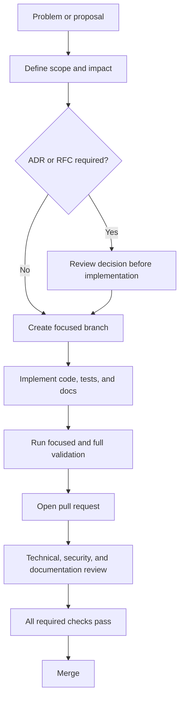

# Contributing to Nightlock

Thank you for improving Nightlock. Because the project handles passwords and encrypted files, correctness, compatibility, and reviewability take priority over speed.

## Before you begin

1. Read the [project README](README.md).
2. Complete the [developer quickstart](docs/getting-started/quickstart.md).
3. Review the [repository tour](docs/getting-started/repository-tour.md).
4. Read [security notes](docs/security.md) before touching secrets, parsing, persistence, clipboard behavior, or packaging.
5. Use a synthetic vault. Never test with production credentials.

## Change workflow



### Scope

- Keep a pull request focused on one coherent outcome.
- Separate mechanical rewrites from behavioral changes.
- Preserve unrelated user work and repository history.
- Explain non-obvious trade-offs in code comments, an ADR, or the PR description.
- Do not combine a format or cryptographic change with unrelated UI work.

### ADR or RFC requirement

Use an ADR for a durable architectural decision that has already reached a concrete proposal. Use an RFC before implementation when a change is large, controversial, compatibility-sensitive, or requires staged rollout.

Examples requiring design review include:

- new cryptographic algorithms or parameters;
- vault envelope or payload compatibility changes;
- changes to atomic-save or recovery guarantees;
- new secret-bearing storage or telemetry;
- a new dependency crossing a trust boundary;
- package signing or update delivery;
- major Qt ownership or session-lifecycle changes.

See [ADR process](docs/governance/adr-process.md) and [RFC process](docs/governance/rfc-process.md).

## Build and test

Baseline validation:

```bash
cmake -S . -B build \
  -DCMAKE_BUILD_TYPE=Release \
  -DNIGHTLOCK_FORCE_VENDORED_SODIUM=ON
cmake --build build --config Release --parallel
ctest --test-dir build --output-on-failure -C Release
```

Run the smallest relevant test first, then the full suite. Add regression tests for defects. Tests involving randomness must use broad, non-flaky properties or frozen vectors as appropriate.

Current CI builds and tests macOS, Windows, and Ubuntu. A green matrix proves compilation and current tests; it does not yet prove every installer works on a clean end-user system.

## Coding expectations

- Use C++20 and existing project conventions.
- Keep Qt types out of the public core API.
- Make ownership and pointer lifetimes explicit.
- Preserve exception-free domain/vault error behavior unless an accepted decision changes it.
- Treat parsed vault bytes as untrusted input.
- Never log passwords, derived keys, decrypted entries, or raw vault payloads.
- Preserve secure wiping and lock sequencing.
- Avoid platform-specific APIs outside guarded platform boundaries.
- Update tests and documentation with the behavior.

## Documentation impact

Use the [change-impact guide](docs/governance/change-impact.md). Update documentation when changing:

- user-visible behavior or CLI output;
- public APIs or lifetime contracts;
- architecture or dependency direction;
- vault bytes, compatibility, recovery, or errors;
- security guarantees, limitations, or data flows;
- prerequisites, CMake options, CI, packages, artifacts, or release steps.

Durable documentation must be English-only. Architecture, flow, and decision documentation should use Mermaid `graph TD` where relationships matter.

## Pull-request requirements

A ready pull request includes:

- a concise problem statement and outcome;
- implementation and trade-off summary;
- tests executed locally;
- platform impact;
- security and compatibility impact;
- documentation changes or a justified `No documentation impact` statement;
- screenshots for material desktop UI changes;
- no real secrets, personal paths, generated build output, or prohibited fonts.

All required checks must pass. Review comments should be resolved through code changes, evidence, or a recorded decision rather than silent dismissal.

## Vulnerabilities and conduct

Report vulnerabilities through [SECURITY.md](SECURITY.md), never through a public issue. Participation is governed by [CODE_OF_CONDUCT.md](CODE_OF_CONDUCT.md).
