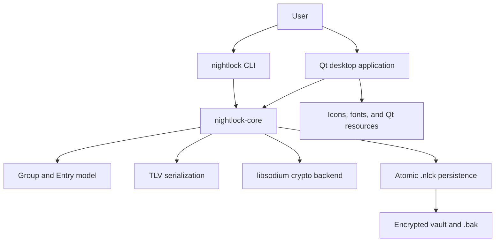

# Nightlock

[](https://github.com/res138/nightlock/releases/latest)
[](https://github.com/res138/nightlock/actions/workflows/build.yml)
[](LICENSE)
[](CMakeLists.txt)
[](docs/getting-started/prerequisites.md)
[](SUPPORT.md)

Nightlock is a cross-platform encrypted password vault with a Qt desktop application and a command-line interface. Both front ends use the same C++20 core for the domain model, password generation, authenticated encryption, serialization, and atomic persistence.

> [!IMPORTANT]
> Nightlock has no password recovery mechanism. Losing the master password means losing access to the vault. Use test vaults during development and keep independent backups of important data.

## Project status

Nightlock is under active development. The current source version is `1.2.6`, read from [VERSION](VERSION). CI builds the final Windows Setup, macOS DMG, and Debian package, then installs and launches their CLI and GUI payloads with build-time Qt paths removed. See [SUPPORT.md](SUPPORT.md) for the supported end-user baselines and remaining limits.

Release packages are currently unsigned. Treat operating-system warnings and artifact-origin verification as material security limitations. See the [release workflow](.github/workflows/release.yml) and the planned release-security documentation before distributing binaries.

The desktop application checks the official stable GitHub Release at startup by default. This can be disabled in General settings; manual checks remain available. The request includes the ordinary network metadata and `Nightlock/<version>` User-Agent described in the [security notes](docs/security.md#network-access-and-update-checks), never vault data. Nightlock asks before opening the installer download in the default browser and does not execute unsigned packages automatically.

## Capabilities

- encrypted `.nlck` vaults using Argon2id and XChaCha20-Poly1305;
- hierarchical groups and password entries;
- login, password, URL, note, icon, code, timestamps, and visual pattern fields;
- cryptographically secure password generation;
- a Qt Widgets desktop interface with search, graph, settings, lock flows, and stable-release update checks;
- a scriptable CLI for vault creation, inspection, mutation, password changes, and generation;
- atomic saves with a previous-image `.bak` file;
- shared vault-format behavior across macOS, Windows, and Linux.

## Architecture



The public core API is Qt-free. The desktop and CLI are separate adapters over the same domain and persistence contracts.

## Quick build

Prerequisites are CMake 3.21 or newer, a C++20 compiler, Qt 6.10.1 with Widgets, SVG, and Network, and either a system libsodium installation or network access for the pinned vendored build.

```bash
cmake -S . -B build \
  -DCMAKE_BUILD_TYPE=Release \
  -DNIGHTLOCK_FORCE_VENDORED_SODIUM=ON
cmake --build build --config Release --parallel
ctest --test-dir build --output-on-failure -C Release
```

For platform installation and troubleshooting, use the [developer quickstart](docs/getting-started/quickstart.md) rather than guessing dependency paths.

## CLI orientation

```bash
build/apps/cli/nightlock --help
build/apps/cli/nightlock gen --length 24 --symbols
```

Do not pass real master passwords as command-line arguments. Interactive commands disable terminal echo; `--password-stdin` exists for controlled automation and tests.

## Documentation

Start at the [documentation hub](docs/README.md).

| Goal | Document |
|---|---|
| Build the project | [Quickstart](docs/getting-started/quickstart.md) |
| Understand prerequisites | [Prerequisites](docs/getting-started/prerequisites.md) |
| Navigate the repository | [Repository tour](docs/getting-started/repository-tour.md) |
| Make a first contribution | [First change](docs/getting-started/first-change.md) |
| Understand vault bytes | [Vault format](docs/format.md) |
| Review current security properties | [Security notes](docs/security.md) |
| Contribute safely | [CONTRIBUTING.md](CONTRIBUTING.md) |
| Understand support boundaries | [SUPPORT.md](SUPPORT.md) |
| Review the documentation roadmap | [Documentation plan](docs/DOCUMENTATION_PLAN.md) |

## Reports

| Date | Report | Description |
|---|---|---|
| 12 August 2026 | [Comprehensive Security Assessment](docs/reports/Nightlock_Security_Assessment_2026-08-12.docx) | A detailed assessment of Nightlock 1.2.2 covering cryptography, secret lifecycle, storage, platform hardening, software supply chain, and comparisons with KeePassXC/KDBX and other password managers. It includes prioritized findings, remediation requirements, a radical secure-by-default target architecture, and a release roadmap. |

## Contributing and security

Read [CONTRIBUTING.md](CONTRIBUTING.md) before opening a pull request. Architectural changes require an ADR or RFC when they alter durable contracts.

Do not report vulnerabilities or real vault material in public issues. Follow [SECURITY.md](SECURITY.md) for private reporting instructions.

## License

Nightlock is licensed under the [GNU General Public License v3.0](LICENSE). Third-party components and assets have separate terms; see [THIRD_PARTY_NOTICES.md](THIRD_PARTY_NOTICES.md).
