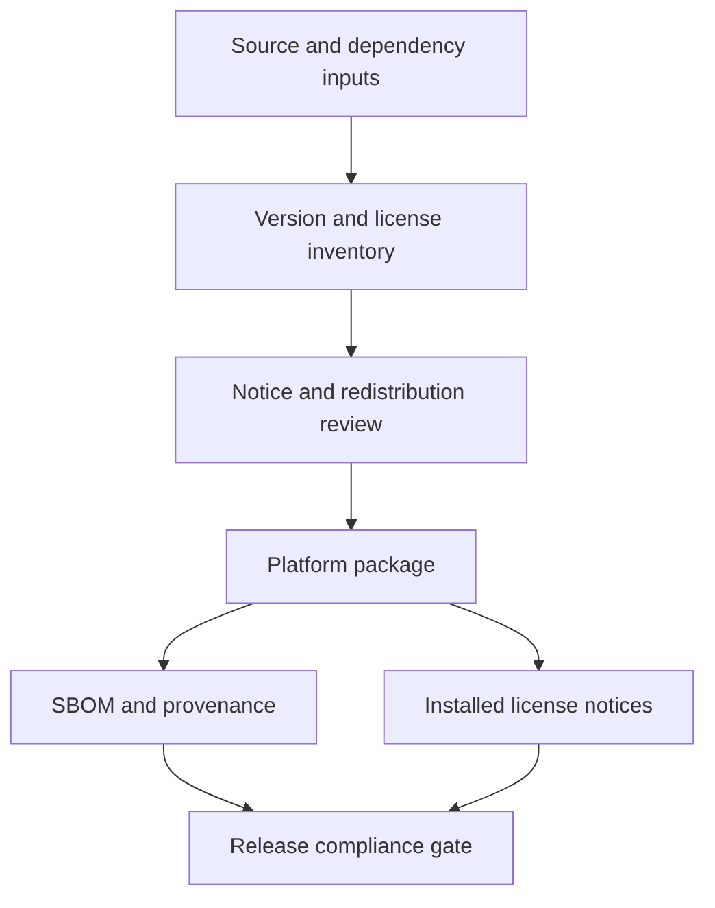

# Third-party notices

This inventory supports engineering and release review. It is not legal advice. Exact license files and redistribution obligations must be verified against the versions included in each release artifact.

## Current inventory

| Component | Use | Included in end-user artifact | Current source/version | License status |
|---|---|---:|---|---|
| Qt Core/Gui/Widgets/SVG/Network and runtime plugins, including the selected SecureTransport, Schannel, or OpenSSL TLS backend | Desktop UI, resources, and HTTPS update checks | Yes | Qt 6.10.1 from the official Qt distribution | Verify the exact LGPL/GPL module terms, the complete TLS dependency closure (some Qt builds link or bundle OpenSSL even with a native backend selected), and required notices before release |
| libsodium | KDF, AEAD, random generation, memory utilities | Yes, normally static in CI/release builds | `libsodium-cmake` pinned at commit `9b2848dfc1b917a9410f0de9d81059b26cbfaa8d` | libsodium is ISC-licensed; verify wrapper and transitive notices |
| doctest | Unit-test framework | No | Vendored single header in `third_party/doctest/` | MIT; retain the upstream notice in source distributions |
| Inno Setup | Windows installer builder | Build tool; generated runtime may be included | Installed by Chocolatey in release CI | Verify tool and generated-runtime notices before release |
| `patchelf` and Debian packaging tools | Linux package construction | Tool only | Ubuntu runner packages | Verify package metadata; normally not redistributed as project payload |
| GitHub Actions | Checkout, Qt installation, artifact transport, release publication | No | Workflow action tags in `.github/workflows/` | Pinning and license review belong to release supply-chain policy |
| Nightlock built-in default icons | Desktop content | Yes | `entry.png`, `folder.png`, and `lock.png` in `apps/desktop/resources/icons/` | Confirm original ownership and project-license coverage before release |
| Tango Classic optional icon pack | Downloaded on demand; not bundled into the application | Only after the user downloads it | Tango Icon Theme 0.8.90 from the official freedesktop.org release archive, archive SHA-256 `6e98d8032d57d818acc907ec47e6a718851ff251ae7c29aafb868743eb65c88e` | Upstream declares the icons Public Domain; `COPYING`, `AUTHORS`, and the exact source inventory are retained in `icon-packs/packs/tango-classic/` |
| La Capitaine optional icon pack | Downloaded on demand; not bundled into the application | Only after the user downloads it | La Capitaine Icon Theme tag `v0.6.2`, commit `9c514f1281d895b44a5ac92320dfc36f21aa5984`, archive SHA-256 `e63e4bc97a7bbf4db71f17fa3b1c71086e3ed8b1dc44b4d10f95d97aa7db2c9d` | `GPL-3.0-or-later`; the curated set excludes Apple, Finder, distribution, application, cloud, and service branding, and retains upstream notices, credits, source mapping, renderer details, and per-file hashes in `icon-packs/packs/la-capitaine/` |
| GNOME Legacy 3.12 optional icon pack | Downloaded on demand; not bundled into the application | Only after the user downloads it | GNOME Icon Theme 3.12.0, archive SHA-256 `359e720b9202d3aba8d477752c4cd11eced368182281d51ffd64c8572b4e503a` | Dual-licensed `LGPL-3.0-only OR CC-BY-SA-3.0`; exact upstream notices, authors, source mapping, and per-file hashes are retained in `icon-packs/packs/gnome-legacy-3-12/` |
| Breeze Modern optional icon pack | Downloaded on demand; not bundled into the application | Only after the user downloads it | KDE Breeze Icons 6.29.0 tag `v6.29.0`, commit `a806a2dbc75b9d7d089c2d0053bc5db46a31340a`, archive SHA-256 `2948a313ffe35895b846dde5a93302a1fcd587ad8dfb860b8757629209586fe4` | `LGPL-3.0-or-later`; the exact upstream artwork-library notice, renderer details, source mapping, and per-file hashes are retained in `icon-packs/packs/breeze-modern/` |
| Platinum Community optional icon pack | Downloaded on demand; not bundled into the application | Only after the user downloads it | `@liiift-studio/mac-os9-ui` tag `v2.6.0`, commit `69ede5d5a739428a078f47ffcd0a32067121847a` | Implementation under MIT and original Mac OS 9 UI Kit designs by Michael Feeney under CC BY 4.0; exact notices, attribution, deterministic importer, source mapping, and per-file hashes are retained in `icon-packs/packs/platinum-community/`; no Apple-extracted resources or Apple/Finder branding are included |
| WhiteSur Modern optional icon pack | Downloaded on demand; not bundled into the application | Only after the user downloads it | WhiteSur Icon Theme tag `2026-08-11`, commit `555a4505920475482f62afd02366441a53669c30`, archive SHA-256 `70c1b1b89854655ba054793c1a1e7359842e6f1c3f5320920f715af63bcd75b1` | `GPL-3.0-only`; the curated set excludes branded artwork, including detected Apple, QuickTime, and Intel marks, and retains exact upstream notices, authors, source mapping, renderer details, and per-file hashes in `icon-packs/packs/whitesur-modern/` |
| Papirus Modern optional icon pack | Downloaded on demand; not bundled into the application | Only after the user downloads it | Papirus Icon Theme release `20250501`, annotated tag object `1920d4a1b0d7ffcd8b7ffb2f2cf584d877383c5b`, commit `863243822aa6693d4eb3758fd6444690d365c695`, archive SHA-256 `3831a487f813479ad3224fdbfb0c7023f23056899bc78c93737f341aa655558e` | `GPL-3.0-only`; the curated set excludes third-party logos and retains the exact GPLv3 text, upstream authors and base-work credits, renderer details, per-file source mapping, and PNG hashes in `icon-packs/packs/papirus-modern/` |
| Oxygen Classic optional icon pack | Downloaded on demand; not bundled into the application | Only after the user downloads it | KDE Oxygen Icons 6.29.0 tag `v6.29.0`, tag object `828bb191f7bde7b98dfb88df7db82aaff6891931`, commit `0574833aed5d7f2946d0905168a214a7b604a60e` | `LGPL-3.0-or-later`; the curated set came from a pinned sparse checkout because the official archive is 253 MiB, and retains the artwork-library notice, authors, source mapping, and per-file hashes in `icon-packs/packs/oxygen-classic/` |
| Adwaita Modern optional icon pack | Downloaded on demand; not bundled into the application | Only after the user downloads it | GNOME Adwaita Icon Theme 50.0, tag object `9c528e249ec07ba5f1566ecd467ecb581ef74281`, commit `551245ae75fdc42cde42a8cf24ca2ccab9d3a815`, archive SHA-256 `fac6e0401fca714780561a081b8f7e27c3bc1db34ebda4da175081f26b24d460` | Dual-licensed `LGPL-3.0-only OR CC-BY-SA-3.0`; exact upstream notices, authors, SVG source mapping, renderer details, and per-file hashes are retained in `icon-packs/packs/adwaita-modern/` |
| Legacy `P1`–`P7` icon collections | Source-only historical content; explicitly excluded from application installation and the download catalog | No | `apps/desktop/resources/icons/P1`–`P7` | Provenance and redistribution terms remain unresolved; do not publish as packs until reviewed |
| Nightlock application icons | Executable and package identity | Yes | `apps/desktop/resources/` and `packaging/linux/icons/` | Confirm original ownership and project-license coverage |
| San Francisco fonts | Optional desktop fonts outside macOS | No; files are intentionally excluded | User obtains them from Apple | Apple terms prohibit repository redistribution; see the local font README |

## Required release evidence

Before publishing a release, the release owner must:

1. produce the exact dependency and asset inventory for each platform artifact;
2. verify versions, licenses, linkage modes, and required notices;
3. include GPLv3 and all required third-party notices in the installed package or an adjacent discoverable location;
4. verify that prohibited font files are absent;
5. resolve icon-pack provenance before redistribution;
6. retain an SBOM and build-provenance record with the release;
7. record unresolved legal or provenance questions as release blockers, not informal warnings.

## Maintenance rules

- Update this file whenever a dependency, action, packaged plugin, font, icon set, or build tool changes.
- Do not copy license names from memory; verify upstream files for the exact version.
- Keep build-only dependencies distinct from shipped runtime content.
- Record static versus dynamic linkage because obligations and replacement mechanisms may differ.
- Keep the machine-generated SBOM separate from this human-reviewed summary.

Related source: [font licensing note](apps/desktop/resources/fonts/README.md), [dependency plan](docs/DOCUMENTATION_PLAN.md), and [release workflow](.github/workflows/release.yml).
