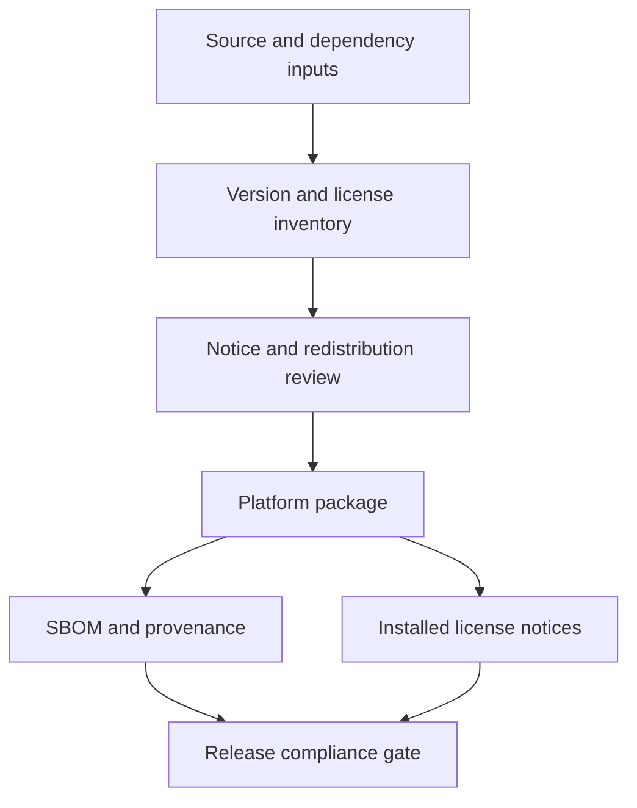

# Third-party notices

This inventory supports engineering and release review. It is not legal advice. Exact license files and redistribution obligations must be verified against the versions included in each release artifact.

## Current inventory

| Component | Use | Included in end-user artifact | Current source/version | License status |
|---|---|---:|---|---|
| Qt Core/Gui/Widgets/SVG/Network and runtime plugins, including the selected SecureTransport, Schannel, or OpenSSL TLS backend | Desktop UI, resources, and HTTPS update checks | Yes | Qt 6.10.1 from the official Qt distribution | Verify the exact LGPL/GPL module terms, the complete TLS dependency closure (some Qt builds link or bundle OpenSSL even with a native backend selected), and required notices before release |
| libsodium | KDF, AEAD, random generation, memory utilities | Yes, normally static in CI/release builds | `libsodium-cmake` pinned at commit `9b2848dfc1b917a9410f0de9d81059b26cbfaa8d` | libsodium is ISC-licensed; verify wrapper and transitive notices |
| doctest | Unit-test framework | No | Vendored single header in `third_party/doctest/` | MIT; retain the upstream notice in source distributions |
| Inno Setup | Windows installer builder | Build tool; generated runtime may be included | Installed by Chocolatey in release CI | Verify tool and generated-runtime notices before release |
| `patchelf` and Debian packaging tools | Linux package construction | Tool only | Ubuntu runner packages | Verify package metadata; normally not redistributed as project payload |
| GitHub Actions | Checkout, Qt installation, artifact transport, release publication | No | Workflow action tags in `.github/workflows/` | Pinning and license review belong to release supply-chain policy |
| Nightlock icon packs | Desktop content | Yes | `apps/desktop/resources/icons/` | Provenance and redistribution terms are not yet documented; release review blocker |
| Nightlock application icons | Executable and package identity | Yes | `apps/desktop/resources/` and `packaging/linux/icons/` | Confirm original ownership and project-license coverage |
| San Francisco fonts | Optional desktop fonts outside macOS | No; files are intentionally excluded | User obtains them from Apple | Apple terms prohibit repository redistribution; see the local font README |

## Required release evidence

Before publishing a release, the release owner must:

1. produce the exact dependency and asset inventory for each platform artifact;
2. verify versions, licenses, linkage modes, and required notices;
3. include GPLv3 and all required third-party notices in the installed package or an adjacent discoverable location;
4. verify that prohibited font files are absent;
5. resolve icon-pack provenance before redistribution;
6. retain an SBOM and build-provenance record with the release;
7. record unresolved legal or provenance questions as release blockers, not informal warnings.

## Maintenance rules

- Update this file whenever a dependency, action, packaged plugin, font, icon set, or build tool changes.
- Do not copy license names from memory; verify upstream files for the exact version.
- Keep build-only dependencies distinct from shipped runtime content.
- Record static versus dynamic linkage because obligations and replacement mechanisms may differ.
- Keep the machine-generated SBOM separate from this human-reviewed summary.

Related source: [font licensing note](apps/desktop/resources/fonts/README.md), [dependency plan](docs/DOCUMENTATION_PLAN.md), and [release workflow](.github/workflows/release.yml).
