# Nightlock Developer Documentation Program

| Field | Value |
|---|---|
| Status | Active implementation plan |
| Audience | Maintainers, contributors, security reviewers, release engineers, and future technical writers |
| Scope | Developer and operator documentation for the entire Nightlock repository |
| Language | English only |
| Documentation model | Docs as code, versioned with the implementation |
| Diagram standard | Mermaid using `graph TD` unless an exception is explicitly approved |
| Initial baseline | Nightlock 1.2.0 source line, based on the repository state after PR #10 |

## Implementation progress

The first NL10 increment establishes root entry points, onboarding, governance, GitHub review contracts, and five evidence-linked retrospective ADRs. Deep architecture, security, reference, engineering-quality, operations, generated-reference, and documentation-site work remains staged in the roadmap below.

The audit in Section 4 records the pre-implementation baseline and is intentionally preserved as historical input to the program.

## 1. Executive objective

Build a documentation system that lets a new engineer understand the product, build it on any supported platform, make a safe change, validate that change, review its security impact, and ship a release without relying on undocumented tribal knowledge.

The program must produce documentation that is:

- authoritative enough for design and security review;
- navigable from a single repository entry point;
- explicit about ownership, contracts, invariants, and failure modes;
- verified in CI for syntax, links, diagrams, examples, and freshness signals;
- versioned with the code whose behavior it describes;
- useful both as onboarding material and as an operational reference;
- concise at the point of use, while providing deep linked references;
- continuously maintained through pull-request requirements and code-to-documentation ownership rules.

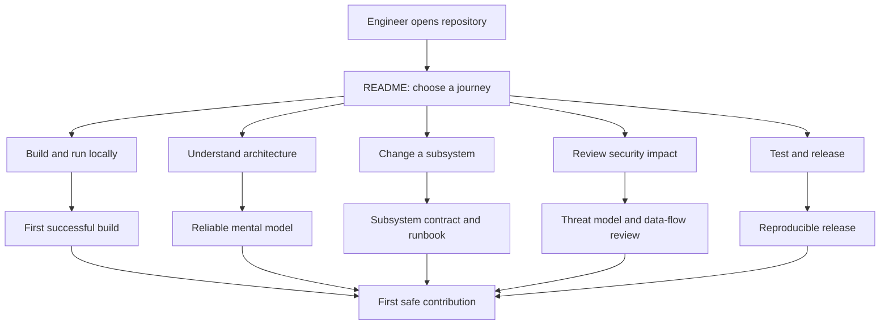

## 2. Success criteria

The documentation program is complete only when all of the following outcomes are measurable:

1. A developer with C++ experience can clone, configure, build, test, and launch Nightlock on a supported platform in 30 minutes or less.
2. A developer can identify the owner, public contract, dependencies, persistence behavior, tests, and security considerations of every first-party module.
3. Every release can be produced from a clean checkout by following one documented procedure.
4. The vault create, open, save, password-change, and lock flows are represented both in prose and in Mermaid `graph TD` diagrams.
5. The desktop, CLI, core, packaging, CI, and release boundaries are documented without requiring source-code archaeology.
6. All committed Markdown, internal links, external links, and Mermaid diagrams are validated automatically.
7. Pull requests that alter a documented contract must update the corresponding document or explicitly record why no update is required.
8. Security-sensitive documentation distinguishes guarantees, best-effort protections, accepted limitations, and future work.
9. Documentation examples are executable or mechanically checked whenever practical.
10. No document depends on a single maintainer's memory to remain correct.

## 3. Documentation non-goals

This program does not:

- duplicate self-evident implementation details line by line;
- promise security properties that are not enforced by code and tests;
- turn debug-only GUI hooks into supported public product interfaces;
- describe unsupported platforms as supported;
- publish secrets, private signing material, personal paths, or incident-sensitive data;
- replace source-level comments for local invariants;
- freeze design decisions that should remain open through an ADR or RFC process.

## 4. Baseline audit before implementation

### 4.1 Existing strengths

| Area | Existing source | Assessment |
|---|---|---|
| Vault format | `docs/format.md` | Strong low-level specification with offsets, TLV tags, compatibility rules, and atomic-save behavior |
| Security | `docs/security.md` | Strong initial summary of cryptography, in-memory handling, and accepted limitations |
| Font licensing | `apps/desktop/resources/fonts/README.md` | Useful local explanation of a non-obvious licensing constraint |
| Public core API | `core/include/nightlock/*.hpp` | Good inline contract comments, but no navigable API overview |
| Build configuration | Root and module `CMakeLists.txt` files | Behavior is encoded in CMake comments, but there is no developer build guide |
| CI and release | `.github/workflows/*.yml` | Workflows exist, but trigger semantics, artifacts, failure handling, and release responsibilities are undocumented |
| Packaging | `packaging/` scripts | Important platform knowledge exists primarily as shell/Inno comments |
| Tests | `tests/` | Good core and CLI coverage, but no testing strategy, coverage map, or contribution guidance |

### 4.2 Critical gaps

| Gap | Developer impact | Priority |
|---|---|---:|
| No root `README.md` | No product summary, supported-platform statement, or navigation entry point | P0 |
| No onboarding or prerequisites guide | First build depends on experimentation and local knowledge | P0 |
| No architecture overview | Module boundaries and dependency direction are implicit | P0 |
| No desktop architecture guide | Qt object ownership, model/view relationships, lock-state transitions, and debug hooks are difficult to discover | P0 |
| No CLI reference | Commands, exit codes, environment variables, path resolution, and scripting guarantees are not centralized | P0 |
| No release runbook | Tagging, artifact names, validation, rollback, and unsigned-package caveats are not operationally documented | P0 |
| No contribution standard | Review expectations, commit scope, tests, and documentation obligations are undefined | P0 |
| No ADR process | Cross-cutting choices have no durable decision history | P1 |
| No documentation CI | Broken links, invalid Mermaid, style drift, and stale examples can merge silently | P1 |
| No ownership map | Review responsibility is not explicit | P1 |
| No dependency and upgrade policy | Qt, libsodium wrapper, actions, and packaging tools can drift without a controlled process | P1 |
| No troubleshooting knowledge base | Common failures must be rediscovered | P1 |
| No public API generation | Header contracts are not indexed or cross-linked | P2 |
| No documentation website | Repository Markdown remains usable, but deep content is harder to search and browse | P2 |

## 5. Audience model

Each document must name its primary audience and the task it enables.

| Persona | First question | Required destination |
|---|---|---|
| First-time contributor | How do I build and run the project? | `README.md` and `docs/getting-started/` |
| Core engineer | What invariants must persistence and crypto preserve? | `docs/architecture/core.md`, `docs/security/`, and `docs/reference/vault-format.md` |
| Desktop engineer | How do the Qt models, windows, services, and lock state interact? | `docs/architecture/desktop.md` |
| CLI engineer | What commands, exit codes, streams, and paths are contractual? | `docs/reference/cli.md` |
| Security reviewer | Where do secrets flow, persist, copy, and disappear? | `docs/security/threat-model.md` and `docs/security/secret-lifecycle.md` |
| Release engineer | How do I produce, verify, publish, and recover a release? | `docs/operations/releasing.md` |
| Build engineer | Which platform dependencies and CMake options are supported? | `docs/development/building.md` |
| Reviewer | Which tests and documents must change with this code? | `CONTRIBUTING.md` and `docs/governance/change-impact.md` |
| Incident responder | What should I do after a broken release or suspected vault issue? | `docs/operations/incident-response.md` |

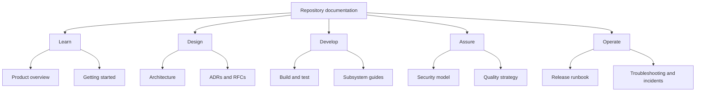

## 6. Documentation principles

### 6.1 Single source of truth

- Product version comes from `VERSION`; CMake, release tags, and prose must agree with it.
- CLI reference is generated from, or tested against, `nightlock --help`.
- Vault constants in prose are checked against source constants where practical.
- Supported CI platforms are derived from the workflow matrix or verified against it.
- Artifact names in the release runbook are checked against `release.yml`.
- Public API details live near public headers; narrative documents link to them instead of reproducing every declaration.

### 6.2 Layered disclosure

Every major topic must support three depths:

1. **Orientation:** what the subsystem does and when to read more.
2. **Working knowledge:** how to build, modify, test, or operate it.
3. **Reference depth:** exact contracts, failure modes, invariants, file layouts, and compatibility rules.

### 6.3 Evidence over assertion

Security and reliability claims must link to at least one of:

- an enforcing code path;
- a unit, integration, or packaging test;
- a frozen test vector;
- a CI check;
- an accepted ADR that explicitly describes the trade-off.

### 6.4 Documentation is part of the change

A code change is incomplete when it changes a user-visible behavior, public API, architecture boundary, vault format, threat model, build command, dependency, CI workflow, package layout, or release procedure without updating the mapped document.

### 6.5 Security-aware writing

Use precise labels:

- **Guarantee:** enforced for all supported configurations.
- **Best effort:** attempted but can fail due to platform or resource limits.
- **Accepted limitation:** understood exposure with an explicit rationale.
- **Unsupported:** behavior outside the maintained contract.
- **Future work:** desired behavior without a present commitment.

## 7. Target information architecture

```text
README.md
CONTRIBUTING.md
SECURITY.md
SUPPORT.md
CHANGELOG.md
CODE_OF_CONDUCT.md
THIRD_PARTY_NOTICES.md
docs/
  README.md
  DOCUMENTATION_PLAN.md
  getting-started/
    quickstart.md
    prerequisites.md
    repository-tour.md
    first-change.md
  development/
    building.md
    configuration.md
    testing.md
    debugging.md
    coding-standards.md
    dependencies.md
    static-analysis.md
    sanitizers.md
    fuzzing.md
    coverage.md
    performance.md
    accessibility.md
    platform-notes.md
  architecture/
    overview.md
    core.md
    desktop.md
    cli.md
    persistence.md
    resource-loading.md
    error-model.md
  security/
    overview.md
    threat-model.md
    secret-lifecycle.md
    cryptography.md
    secure-development.md
    privacy-and-telemetry.md
    vulnerability-response.md
  reference/
    cli.md
    core-api.md
    vault-format.md
    configuration.md
    environment-variables.md
    exit-codes.md
    package-layouts.md
    licenses.md
  operations/
    ci.md
    releasing.md
    release-validation.md
    release-security.md
    rollback.md
    troubleshooting.md
    incident-response.md
  governance/
    documentation-style.md
    change-impact.md
    ownership.md
    adr-process.md
    rfc-process.md
  adr/
    README.md
    template.md
    0001-vault-cryptography.md
    0002-tlv-forward-compatibility.md
    0003-atomic-save-protocol.md
    0004-qt-desktop-architecture.md
    0005-cross-platform-package-layouts.md
  rfcs/
    README.md
    template.md
  generated/
    cli-help.md
    core-api/
  assets/
    screenshots/
    diagrams/
.github/
  CODEOWNERS
  PULL_REQUEST_TEMPLATE.md
  ISSUE_TEMPLATE/
  workflows/
    docs.yml
```

The exact split may evolve, but stable top-level categories must remain predictable: getting started, development, architecture, security, reference, operations, and governance.

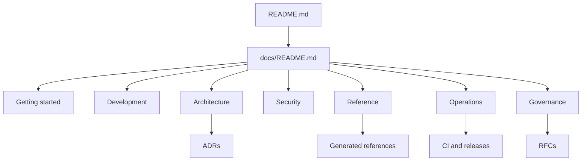

## 8. Required document specifications

### 8.1 Root entry points

#### `README.md`

Required content:

- one-paragraph product description and security boundary;
- supported desktop platforms and artifact types;
- project status and current stability statement;
- concise feature list for the GUI and CLI;
- one-command or minimal quickstart links per platform;
- high-level architecture `graph TD`;
- links to developer docs, security policy, contribution guide, license, releases, and issue tracker;
- explicit warning that forgotten master passwords cannot be recovered;
- badges for build, release, documentation, license, and supported C++ version;
- no unverified marketing claims.

Acceptance criteria:

- a reader reaches any primary documentation journey in two clicks or fewer;
- all commands are copied from validated guides;
- platform and release claims match CI and packaging code.

#### `docs/README.md`

Required content:

- documentation map organized by task rather than directory alone;
- audience-based navigation table;
- diagram legend and link to the style guide;
- maturity status for each document: draft, reviewed, or authoritative;
- "where to update documentation" guidance.

#### `CONTRIBUTING.md`

Required content:

- local setup and first validation command;
- branch and pull-request expectations;
- scope and commit hygiene;
- coding, testing, security, and documentation checklists;
- platform impact rules;
- requirement to update ADRs for architectural changes;
- handling of generated files;
- review and merge criteria;
- issue-reporting and vulnerability-reporting separation.

#### `SECURITY.md`

Required content:

- supported versions;
- private vulnerability-reporting channel or clearly marked placeholder until one exists;
- expected acknowledgment and triage targets;
- disclosure policy;
- explicit prohibition on reporting live secrets in public issues;
- links to the technical threat model and security design documents.

#### `SUPPORT.md`

Required content:

- supported Nightlock release lines;
- supported operating systems and CPU architectures;
- minimum supported Qt, compiler, CMake, and system-library versions;
- vault-format compatibility guarantees;
- end-of-life and deprecation rules;
- the difference between community support, security support, and best-effort troubleshooting;
- migration expectations when support is removed.

#### `CHANGELOG.md`

Use a human-curated Keep a Changelog structure and Semantic Versioning. Maintain an `Unreleased` section with Added, Changed, Deprecated, Removed, Fixed, and Security categories. GitHub Release notes may be generated from the changelog, but they must not become a conflicting second source of release history. Every release procedure must move relevant entries from `Unreleased` into a dated version section and link the version comparison.

#### `THIRD_PARTY_NOTICES.md`

Inventory every dependency and redistributed asset, including Qt modules and plugins, libsodium, doctest, packaging tools, icon packs, and fonts. Record version, purpose, linkage or packaging mode, license, copyright, upstream source, redistribution status, required notices, and whether the component ships in end-user artifacts. Include the notices file in packaged artifacts where required and verify it during release validation.

### 8.2 Getting-started set

#### `docs/getting-started/prerequisites.md`

Document by platform:

- compiler and minimum language mode;
- CMake version;
- Qt version and required components;
- system or vendored libsodium behavior;
- Linux packages;
- Windows Visual Studio generator behavior;
- macOS Xcode command-line tools;
- first-configure network requirement for vendored libsodium;
- expected disk usage, especially the icon resources and Qt installation;
- commands to verify every prerequisite.

#### `docs/getting-started/quickstart.md`

Provide tested paths for:

- full desktop + CLI + tests;
- CLI and core only;
- system libsodium;
- forced vendored libsodium;
- Release and developer-friendly build types;
- running core tests and CLI smoke tests;
- launching each platform's desktop binary from the build tree.

#### `docs/getting-started/repository-tour.md`

Explain every top-level directory, its owner, allowed dependencies, generated content, and the first document to read before editing it.

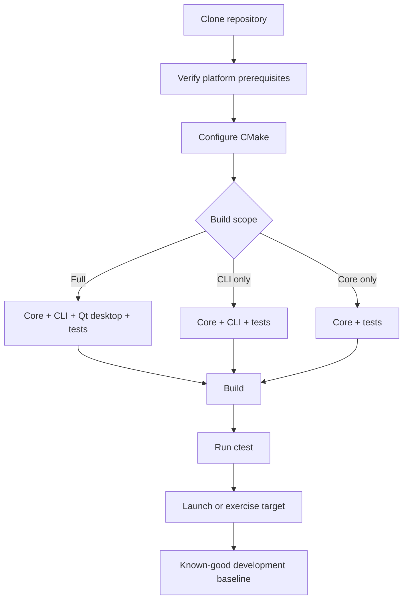

#### `docs/getting-started/first-change.md`

Walk through one low-risk change from branch creation to PR, including formatting, focused tests, full tests, documentation impact, and CI interpretation. It must not teach a change that touches cryptography or the file format.

### 8.3 Architecture set

#### `docs/architecture/overview.md`

Use a C4-inspired set of `graph TD` diagrams to document:

- user and external-system context;
- executable and library containers;
- dependency direction;
- persisted data and platform resources;
- trust boundaries;
- build-time versus runtime dependencies.

The authoritative top-level dependency model is:

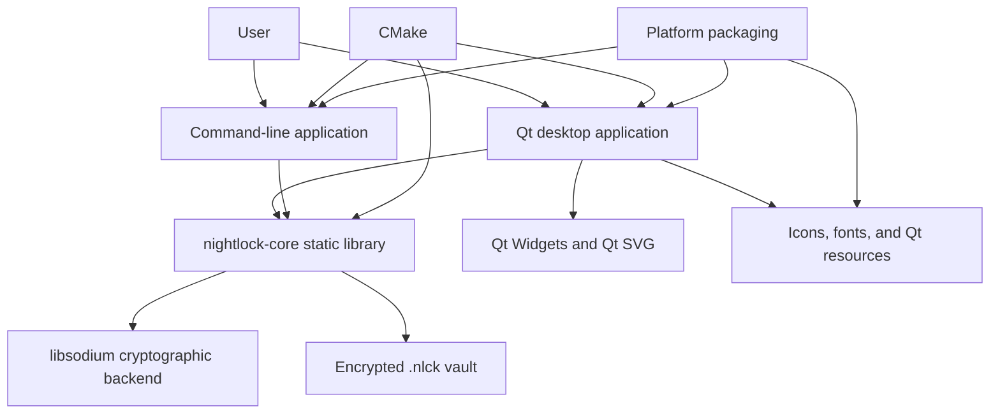

Required narrative:

- desktop and CLI are independent front ends over the same core;
- `nightlock-core` owns domain data, secret memory, serialization, cryptography, and persistence;
- Qt types must not enter the public core API;
- file-format behavior is backend-neutral despite the current libsodium implementation;
- platform packaging is downstream of the CMake install layout.

#### `docs/architecture/core.md`

Cover:

- `Entry`, `Group`, `VaultFile`, crypto facade, generator, secure containers, TLV, serializer, and atomic writer;
- ownership and pointer-lifetime rules;
- error-return conventions and absence of exceptions in vault/domain APIs;
- allowed dependency direction inside core;
- save and lock invariants;
- test ownership for each component;
- extension points and deliberately closed boundaries.

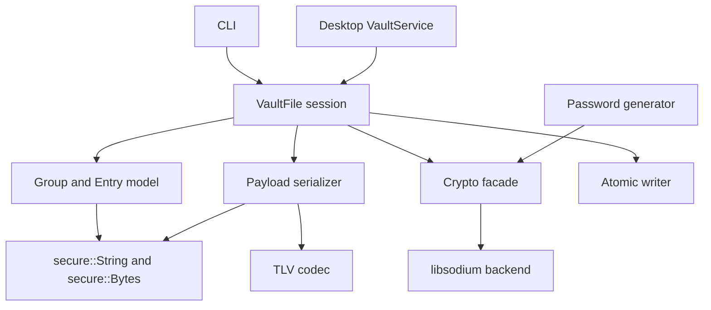

#### `docs/architecture/desktop.md`

Cover:

- `MainWindow` composition and ownership;
- `VaultService` as the persistence/session boundary;
- `GroupTreeModel` and `EntryListModel` responsibilities;
- lock screen create/unlock modes;
- lifecycle of `Group*` and `Entry*` pointers across lock/open operations;
- detail, graph, search, settings, and edit windows;
- user settings and appearance state;
- resource resolution between source tree and installed packages;
- macOS-specific integration;
- debug and screenshot environment hooks, clearly labeled non-public;
- event-flow diagrams for create, open, edit/save, lock, and switch-vault operations.

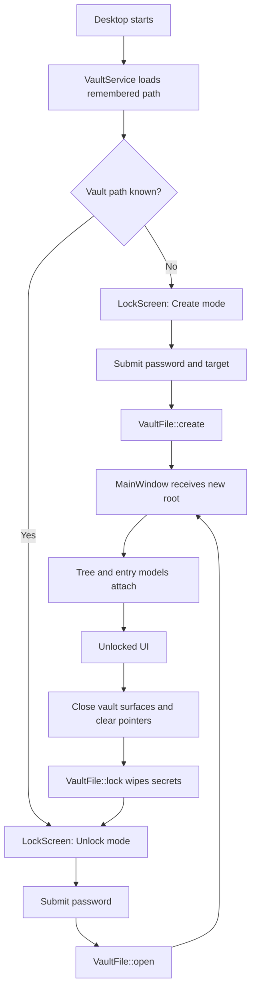

#### `docs/architecture/cli.md`

Cover:

- argument parsing and global option precedence;
- vault-path resolution per platform;
- password input and terminal-echo behavior;
- command dispatch and whether each command reads, mutates, or saves;
- output stream policy and scripting compatibility;
- exit-code taxonomy;
- UTF-8 path output behavior;
- Windows/POSIX portability boundaries;
- smoke-test coverage.

#### `docs/architecture/persistence.md`

Consolidate narrative around session lifecycle, serialization, encryption, backup rotation, atomic replacement, crash states, concurrent writers, and recovery from `.bak`.

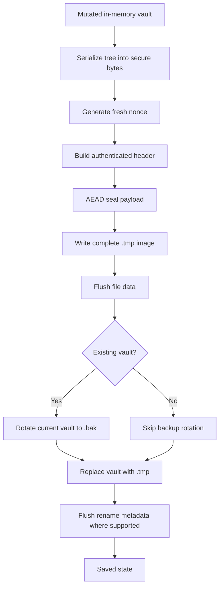

#### `docs/architecture/error-model.md`

Map `VaultError` values to detection points, CLI exit behavior, desktop presentation, retryability, security interpretation, and test coverage. Explain why authentication failure cannot distinguish a wrong password from tampering.

### 8.4 Security set

The existing `docs/security.md` becomes `docs/security/overview.md`; content must be preserved, reviewed, and split only where ownership becomes clearer.

#### `docs/security/threat-model.md`

Required sections:

- assets: master password, derived key, plaintext tree, vault file, backup file, clipboard contents, settings, and release artifacts;
- actors and capabilities;
- trust boundaries;
- supported and unsupported threat scenarios;
- attack surfaces: parser, KDF parameters, GUI copies, CLI stdin, filesystem, backup, package supply chain;
- mitigations and evidence;
- residual risks and accepted limitations;
- review triggers for changes to format, crypto, secret storage, clipboard, serialization, dependencies, or packaging.

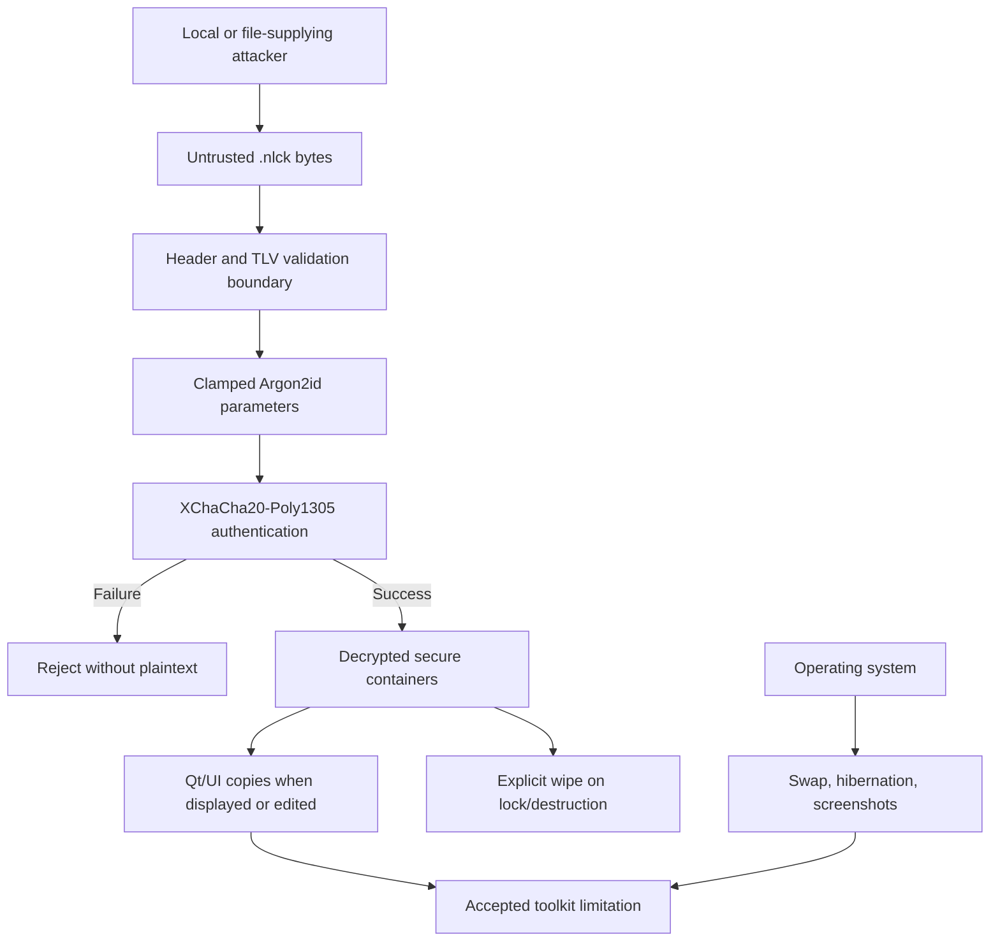

#### `docs/security/secret-lifecycle.md`

Trace secret creation, copying, storage, presentation, clipboard exposure, serialization, encryption, wiping, and destruction. Distinguish core secure containers from Qt and standard-library copies.

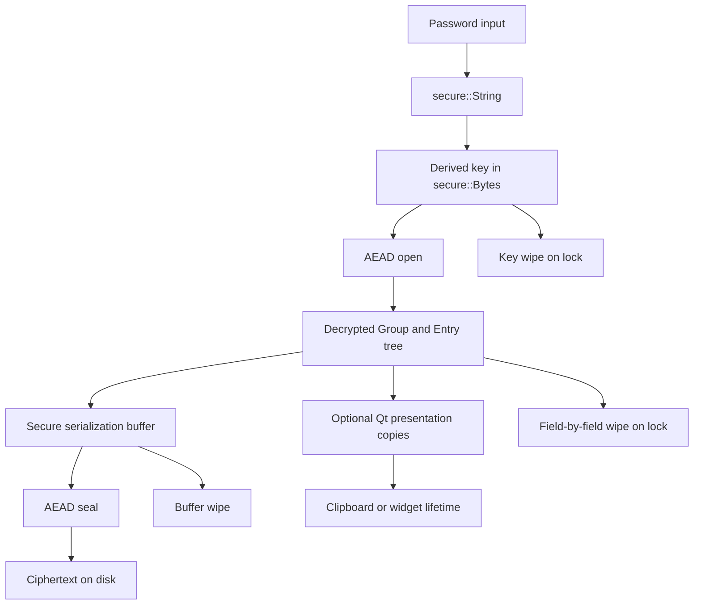

#### `docs/security/cryptography.md`

Document algorithm identifiers, parameters, test vectors, domain assumptions, nonce and salt rules, associated data, compatibility constraints, backend abstraction, and the approval process for any cryptographic change. Link to `reference/vault-format.md` rather than duplicating byte layouts.

#### `docs/security/secure-development.md`

Provide review checklists for parser changes, memory handling, format evolution, platform APIs, dependency updates, logs, diagnostics, crash dumps, clipboard behavior, and test data.

#### `docs/security/privacy-and-telemetry.md`

State whether Nightlock performs network access, telemetry, update checks, crash reporting, or diagnostic upload. Document local settings and metadata, clipboard exposure, operating-system integrations, and the review requirements for introducing any outbound data flow. Absence of telemetry must be treated as a testable product property rather than an implied promise.

### 8.5 Reference set

#### `docs/reference/cli.md`

For every command (`init`, `ls`, `show`, `add`, `rm`, `mkdir`, `passwd`, and `gen`), specify:

- synopsis;
- required and optional arguments;
- stdin behavior;
- stdout and stderr behavior;
- whether secrets may appear in output;
- filesystem effects;
- exit codes;
- examples for interactive and scripted use;
- platform-specific path examples;
- security notes.

The reference must include a tested command-dispatch `graph TD`.

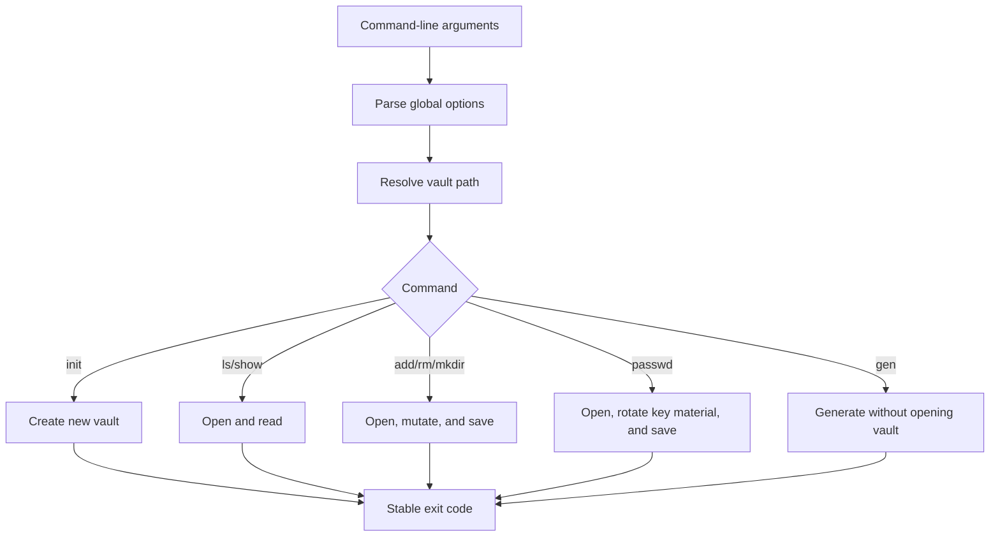

#### `docs/reference/core-api.md`

Provide an indexed narrative for public headers and link to generated API pages. For each public type, record ownership, lifetime, thread-safety status, error behavior, security sensitivity, and stable/unstable status.

#### `docs/reference/vault-format.md`

Move or adapt `docs/format.md` without losing any detail. Add:

- normative versus explanatory wording;
- a compatibility matrix;
- parser limits table;
- canonical and malformed test-vector references;
- recovery behavior;
- format-change checklist;
- diagram from logical model to TLV to authenticated envelope.

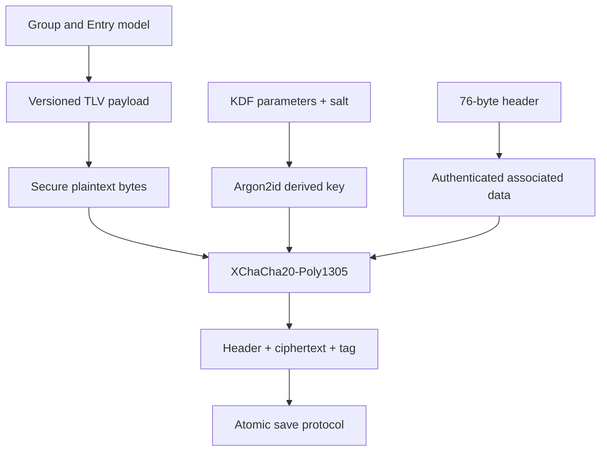

#### `docs/reference/package-layouts.md`

Document installed paths and resource resolution for macOS, Windows, and Linux. Include GUI binary, CLI binary, Qt runtime, plugins, icons, fonts, metadata, PATH behavior, and uninstall behavior.

### 8.6 Development and quality set

#### `docs/development/building.md`

Specify supported generators and tested commands, CMake option matrix, system-versus-vendored libsodium selection, clean rebuild procedure, install staging, and platform-specific output locations.

#### `docs/development/testing.md`

Required content:

- test pyramid and current limitations;
- mapping from components to test files;
- unit-test conventions and doctest configuration;
- CLI smoke-test mechanics;
- manual desktop validation checklist;
- package smoke tests to add;
- security regression requirements;
- deterministic test-vector policy;
- non-flaky randomness test rules;
- commands for focused and full execution;
- expected CI matrix.

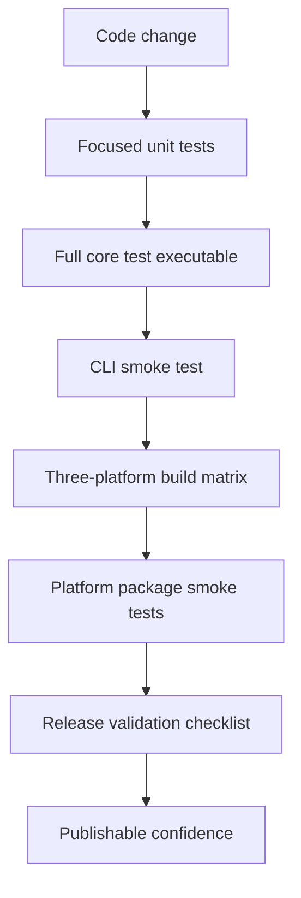

#### `docs/development/debugging.md`

Document debugger setup, build-type choices, useful environment variables, desktop screenshot/test hooks, safe handling of test vaults, and platform-specific diagnostics. Clearly prohibit using production vaults in debugging examples.

#### `docs/development/dependencies.md`

For Qt, libsodium, the libsodium CMake wrapper, doctest, GitHub Actions, Inno Setup, `patchelf`, and OS packaging tools, record:

- purpose and owner;
- version source;
- update procedure;
- security-review requirements;
- compatibility test scope;
- rollback procedure;
- license location.

#### Engineering-quality guides

Create dedicated, command-oriented guides for:

- C++ formatting and coding standards;
- `clang-tidy` or the selected static-analysis suite, including suppression policy;
- AddressSanitizer, UndefinedBehaviorSanitizer, LeakSanitizer, and future ThreadSanitizer use;
- coverage measurement with risk-based expectations rather than a vanity percentage;
- fuzzing of the vault header, TLV reader, decrypted payload parser, and recovery paths;
- performance baselines for KDF latency, large-vault open/save, memory use, startup, and resource loading;
- desktop accessibility requirements for keyboard navigation, focus order, contrast, screen readers, reduced motion, and platform conventions.

Each guide must define the local command, CI schedule, ownership, failure triage, exception process, retained artifacts, and graduation criteria for becoming merge-blocking.

### 8.7 Operations set

#### `docs/operations/ci.md`

Explain event triggers, permissions, matrix behavior, cache behavior, runner images, step purposes, logs, reruns, expected artifacts, and the difference between build validation and package validation.

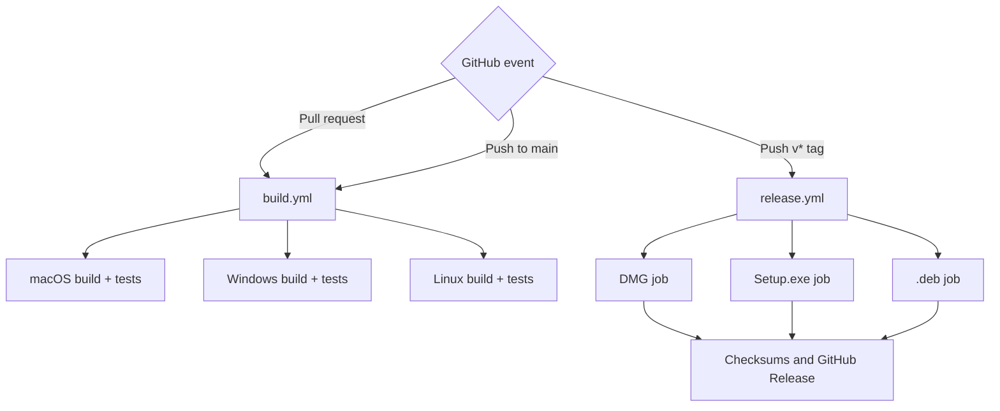

#### `docs/operations/releasing.md`

Required runbook:

1. verify a clean, green `main` commit;
2. select a semantic version and update the authoritative `VERSION` file;
3. prepare release notes and compatibility warnings;
4. create an annotated `v*` tag at the intended commit;
5. push the tag and observe all platform jobs;
6. validate artifact names and checksums;
7. install and smoke-test every artifact on a clean target system;
8. validate CLI and GUI versions;
9. publish or confirm the GitHub Release;
10. announce, monitor, and record the release;
11. execute rollback or superseding-release procedure when validation fails.

Include explicit caveats for current ad-hoc/unsigned packaging and the resulting operating-system warnings.

#### `docs/operations/release-validation.md`

Define a per-platform checklist covering installation, launch, CLI availability, Qt plugin loading, resource discovery, vault create/open/save, password change, backup creation, uninstall, and checksum verification.

#### `docs/operations/release-security.md`

Document the artifact trust chain: pinned and verified build inputs, least-privilege workflow permissions, dependency checksums, software bill of materials (SBOM), GitHub artifact attestations or equivalent provenance, Windows Authenticode signing, macOS Developer ID signing and notarization, checksum publication, signature verification, key custody, key rotation, compromise response, and revocation. The current unsigned state must remain explicit until signing is implemented; checksums produced by the same workflow are integrity metadata, not independent proof of origin.

#### `docs/operations/troubleshooting.md`

Start with known failure families:

- Qt not found;
- vendored libsodium cannot download;
- platform compiler mismatch;
- Windows wide-path or MSVC-specific diagnostics;
- macOS bundle signing or framework deployment;
- Linux missing XCB/Wayland libraries;
- missing licensed fonts;
- icon resources not found;
- test vault cleanup;
- GitHub Actions cache and runner failures;
- package starts locally but fails after installation.

Each entry must contain symptoms, likely causes, safe diagnostics, resolution, and escalation criteria.

### 8.8 Governance set

#### `docs/governance/documentation-style.md`

Define the writing, structural, diagram, naming, linking, and review standards in Sections 10 and 11 of this plan.

#### `docs/governance/change-impact.md`

Maintain a code-to-documentation matrix and a decision tree for reviewers.

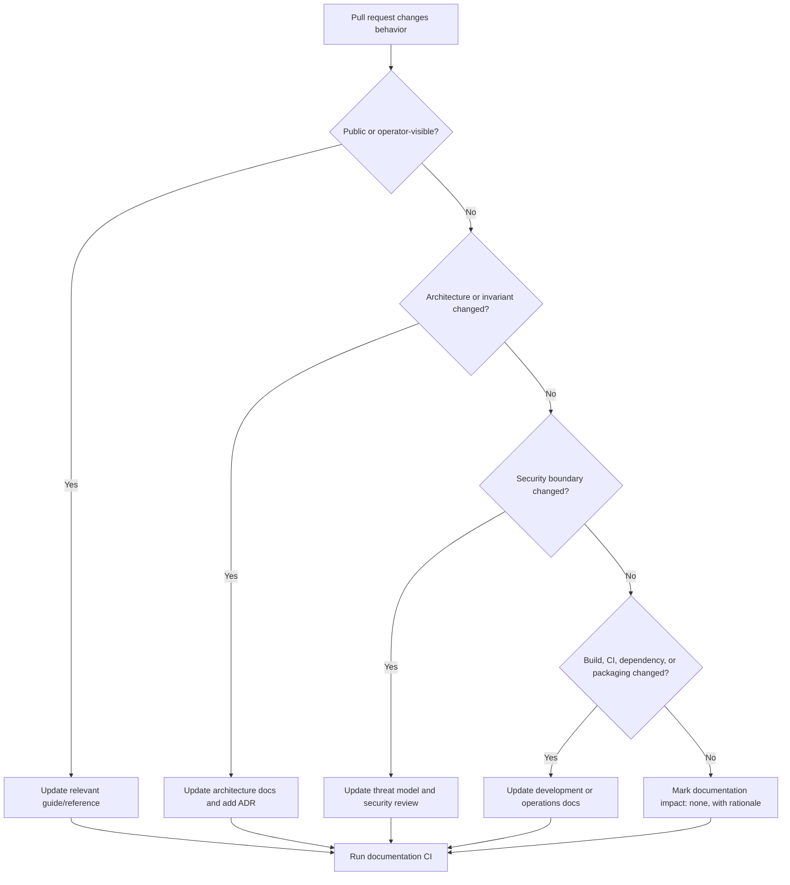

#### ADR and RFC processes

- ADRs record accepted, cross-cutting, durable technical decisions.
- RFCs propose substantial changes before implementation.
- ADRs are immutable after acceptance except for status and typo corrections; superseding decisions create a new ADR.
- ADRs written after an implementation already exists must use `Accepted retrospectively` status, link the introducing commits, and never invent historical alternatives or discussions that cannot be evidenced.
- Every ADR includes context, decision, alternatives, consequences, security impact, compatibility impact, operational impact, and validation evidence.
- Every RFC includes motivation, detailed design, migration, rejected alternatives, test plan, documentation plan, rollout, rollback, and unresolved questions.

## 9. Code-to-documentation ownership matrix

| Code or configuration path | Required documentation review |
|---|---|
| `core/include/nightlock/` | Core API reference, architecture, examples, compatibility |
| `core/src/crypto/` | Cryptography, threat model, test vectors, ADR review |
| `core/src/format/` | Vault format, compatibility matrix, migration policy |
| `core/src/secure/` | Secret lifecycle, security limitations, platform behavior |
| `core/src/vault/` | Persistence, recovery, error model, threat model |
| `core/src/model/` | Domain model, ownership, serialization mapping |
| `core/src/generator/` | Generator reference and security notes |
| `apps/cli/` | CLI reference, exit codes, environment variables, smoke tests |
| `apps/desktop/src/models/` | Desktop architecture and pointer-lifetime rules |
| `apps/desktop/src/windows/` | Desktop state flows and UI contribution guide |
| `apps/desktop/src/vaultservice.*` | Session lifecycle, persistence, lock/unlock flow |
| `apps/desktop/src/respaths.*` | Resource loading and package layouts |
| `apps/desktop/resources/` | Resource licensing, attribution, package layout |
| `CMakeLists.txt`, `cmake/` | Prerequisites, building, configuration, dependencies |
| `tests/` | Testing strategy and coverage map |
| `.github/workflows/build.yml` | CI guide and merge criteria |
| `.github/workflows/release.yml` | Release runbook, artifact reference, permissions |
| `packaging/` | Package layouts, release validation, troubleshooting |

## 10. Page contract and writing standard

Every durable document must contain or make obvious:

1. **Title and purpose.** State the task or contract the page supports.
2. **Audience.** Identify who should read it.
3. **Scope.** Define what is and is not covered.
4. **Prerequisites.** Link required prior knowledge.
5. **Authoritative sources.** Link code, tests, workflows, or ADRs.
6. **Main content.** Prefer task order for guides and stable taxonomy for references.
7. **Failure modes.** Explain expected errors and unsafe recovery actions.
8. **Validation.** Provide commands or checks that prove success.
9. **Related documents.** Link both upstream concepts and downstream procedures.
10. **Ownership metadata.** Name a team or role, not only an individual.
11. **Freshness signal.** Record the last behavior review, not merely the last typo edit.

### Writing rules

- Use English only, with American English spelling unless a platform term requires otherwise.
- Use active voice and direct instructions.
- Put the outcome before implementation details.
- Use present tense for current behavior and clearly label planned behavior.
- Use "must" for requirements, "should" for strong recommendations, and "may" for options.
- Do not use "simply," "obviously," "just," or other language that hides complexity.
- Define acronyms on first use.
- Use one term consistently for each concept: vault, entry, group, desktop application, CLI, core, artifact, and release.
- Use sentence case for headings.
- Use fenced code blocks with a language identifier.
- Keep commands copyable and avoid shell prompts inside command blocks.
- Use relative links for repository files and stable external links for third-party references.
- Never use absolute developer-machine paths.
- Label destructive, irreversible, secret-exposing, or compatibility-breaking steps before the command.
- Separate normative format requirements from implementation commentary.
- Pair every non-trivial example with expected output or an explicit success condition.

## 11. Mermaid `graph TD` standard

### 11.1 Required usage

Use Mermaid `graph TD` regularly for:

- system and component architecture;
- dependency direction;
- state transitions;
- data and secret flow;
- create/open/save/lock lifecycles;
- CI and release pipelines;
- decision trees;
- documentation navigation;
- implementation dependencies.

Each architecture or operational document should contain at least one meaningful `graph TD` diagram. Long documents should add a diagram at each major boundary where prose alone would force the reader to reconstruct relationships.

### 11.2 Diagram rules

- Begin every standard diagram with `graph TD`.
- Quote node labels containing spaces or punctuation.
- Give nodes stable, readable identifiers.
- Keep a diagram focused on one question.
- Target 5 to 15 nodes; split larger diagrams by abstraction level.
- Label branch edges when the decision is not self-evident.
- Show dependency arrows in one consistent direction.
- Explain the diagram in adjacent prose; diagrams are not standalone truth.
- Do not encode critical information only through color.
- Avoid raw implementation symbols in orientation diagrams.
- Link diagrams to exact API names in the following prose when needed.
- Render every diagram in CI with Mermaid CLI.
- Store hand-authored Mermaid in Markdown; store generated SVG only when required by a publication target.

### 11.3 Review checklist

- Does the graph answer a named question?
- Does every arrow have an unambiguous meaning?
- Are trust boundaries and persisted data visible where relevant?
- Does the diagram match current code and tests?
- Can it render in GitHub and the documentation site?
- Is the same concept named consistently in prose and code?

## 12. Documentation tooling and CI

### 12.1 Recommended toolchain

| Tool | Purpose | Policy |
|---|---|---|
| Markdownlint | Structural Markdown consistency | Required on all Markdown |
| Vale | Prose style, terminology, and forbidden-language checks | Required, repository-local rules |
| CSpell | Project terminology and typo detection | Required with reviewed dictionary |
| Lychee or equivalent | Internal and external link validation | Required; external transient failures use controlled retries |
| Mermaid CLI | Render validation for every diagram | Required |
| MkDocs Material | Searchable versioned documentation site | Recommended in Phase 5 |
| Doxygen | Public C++ API extraction | Recommended for `core/include/nightlock/` only |
| CMake/CTest scripts | Executable examples and reference drift tests | Required for critical commands |

### 12.2 Documentation workflow

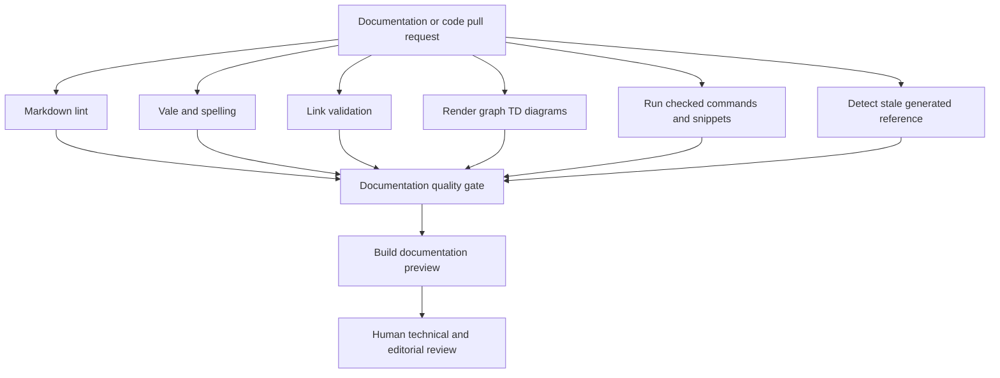

### 12.3 CI behavior

Create `.github/workflows/docs.yml` with:

- triggers on Markdown, documentation config, public headers, CLI command sources, workflows, packaging, and CMake files;
- pinned action versions or commit SHAs according to repository policy;
- least-privilege permissions;
- dependency caching with deterministic lock files;
- separate, named checks for lint, links, diagrams, generated-reference drift, and site build;
- uploaded site preview artifact for review;
- scheduled external-link check, separate from merge-blocking internal links;
- clear failure summaries with the exact file and remediation command.

### 12.4 Drift detection to implement

1. Capture `nightlock --help` and compare it with the committed generated reference.
2. Parse or assert the authoritative `VERSION` value in release documentation tests.
3. Assert documented CMake options exist.
4. Assert the documented CI matrix matches workflow runner labels.
5. Assert release artifact patterns match `release.yml`.
6. Assert every `VaultError` appears in the error-model reference.
7. Assert every public header appears in the core API index.
8. Assert every CLI command appears in the CLI reference.
9. Assert each accepted ADR is indexed.
10. Assert all relative repository links resolve with correct case on Linux.

## 13. Ownership and review model

### 13.1 Roles

| Role | Responsibility |
|---|---|
| Documentation owner | Information architecture, style system, CI, backlog, and freshness review |
| Core owner | Domain, crypto facade, serialization, persistence, and public API correctness |
| Desktop owner | Qt architecture, state transitions, resource loading, and UI test hooks |
| CLI owner | Command semantics, streams, exit codes, and scripting compatibility |
| Security reviewer | Threat model, secret lifecycle, cryptography, dependency risk, and disclosure wording |
| Release owner | CI, packaging, signing status, artifacts, validation, and rollback |
| Contributor | Updates mapped documentation as part of each code change |

If the project has one maintainer, the roles remain distinct review checklists even when one person holds multiple roles.

### 13.2 CODEOWNERS plan

Add ownership patterns for:

- `/docs/security/`, `/docs/reference/vault-format.md`, and crypto/format source paths;
- `/docs/operations/`, workflows, and packaging;
- `/docs/architecture/desktop.md` and desktop sources;
- `/docs/reference/cli.md` and CLI sources;
- documentation tooling and style configuration;
- ADR and RFC directories.

### 13.3 Review requirements

- Technical documents require review from the mapped subsystem owner.
- Security documents require a security-focused review.
- Release runbooks require a dry run or evidence from a real release.
- New normative behavior requires tests or a tracked test gap.
- New diagrams require render validation and technical review.
- Generated pages are reviewed through their source and drift checks, not manual edits.

## 14. Implementation roadmap

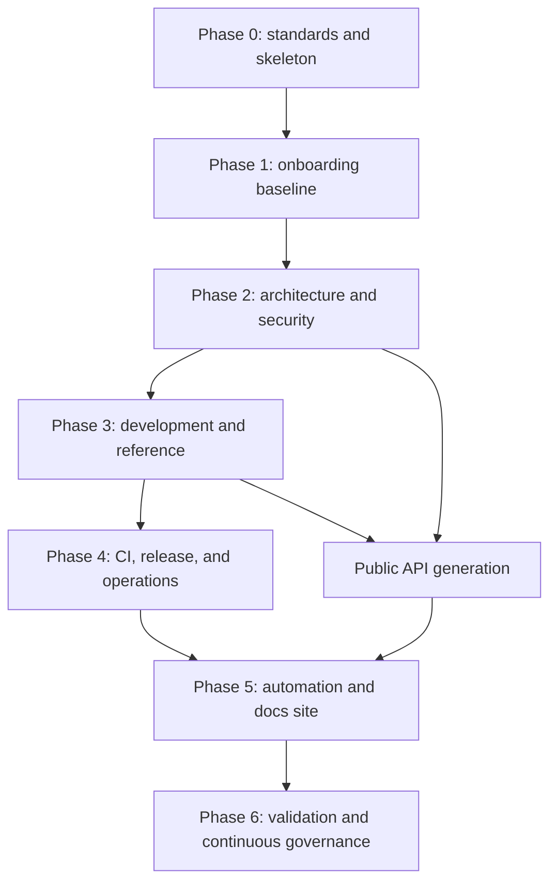

### Phase 0: standards and skeleton

Goal: establish the system before producing large volumes of prose.

Deliverables:

- commit this plan;
- create `docs/README.md` and the target directories;
- add documentation style guide, terminology list, page template, ADR template, and RFC template;
- define status labels and ownership metadata;
- create the initial code-to-documentation matrix;
- add PR template documentation-impact question;
- add initial CODEOWNERS entries;
- select and pin lint, style, spelling, link, and Mermaid tooling;
- add a minimal docs CI gate.

Exit criteria:

- all existing Markdown passes the baseline checks or has a time-bounded exception;
- a contributor can discover where a new page belongs;
- invalid Mermaid fails CI.

### Phase 1: onboarding baseline

Goal: make a first successful contribution reproducible.

Deliverables:

- root README;
- prerequisites, quickstart, repository tour, and first-change tutorial;
- building, configuration, and platform notes;
- contribution guide;
- root security policy;
- validated commands for macOS, Windows, and Ubuntu.

Exit criteria:

- three clean-environment onboarding trials, one per supported OS;
- median time to successful tests is at most 30 minutes excluding tool downloads;
- every undocumented prerequisite discovered during trials becomes a documentation fix.

### Phase 2: architecture and security

Goal: provide a reliable model for high-risk changes.

Deliverables:

- architecture overview;
- core, desktop, CLI, persistence, resource-loading, and error-model documents;
- threat model, secret lifecycle, cryptography, and secure-development guide;
- migration of existing format and security content;
- initial ADR set for existing cross-cutting decisions;
- at least ten reviewed `graph TD` diagrams across these documents.

Exit criteria:

- every first-party target and trust boundary appears in an architecture diagram;
- every secret-bearing path appears in the lifecycle documentation;
- every `VaultError` is mapped to handling behavior;
- security statements have code or test evidence.

### Phase 3: development and reference

Goal: make subsystem changes and reviews repeatable.

Deliverables:

- complete CLI reference;
- core API index;
- testing and debugging guides;
- dependency policy;
- environment variable and exit-code references;
- package layout reference;
- checked examples and generated CLI help;
- Doxygen proof of concept for public core headers.

Exit criteria:

- every CLI command and public core header is indexed;
- focused-test guidance exists for every core component;
- generated-reference drift fails CI.

### Phase 4: CI, release, and operations

Goal: remove tribal knowledge from shipping and recovery.

Deliverables:

- CI guide;
- release, validation, rollback, troubleshooting, and incident runbooks;
- package smoke-test specification;
- artifact and checksum reference;
- unsigned-package and future-signing policy;
- first release rehearsal with recorded findings.

Exit criteria:

- a maintainer other than the author can perform a release rehearsal;
- all three platform artifacts pass documented clean-machine validation;
- rollback ownership and triggers are explicit.

### Phase 5: automation and documentation site

Goal: improve searchability and prevent drift at scale.

Deliverables:

- MkDocs Material site configuration;
- GitHub Pages or artifact-only preview deployment, depending on publication policy;
- Mermaid rendering in site and CI;
- Doxygen integration or linked API publication;
- search, navigation, edit links, and version banner;
- scheduled link and freshness checks;
- documentation health dashboard inputs.

Exit criteria:

- site build is reproducible from a lock file;
- all repository docs remain readable directly on GitHub;
- no site-only syntax blocks critical repository readability.

### Phase 6: validation and continuous governance

Goal: make quality durable rather than launch-only.

Deliverables:

- quarterly documentation review cadence;
- stale-page query and review queue;
- onboarding feedback template;
- documentation issue labels and service targets;
- annual architecture and threat-model review;
- release-runbook retrospective after each release;
- deprecation and archival procedure.

Exit criteria:

- every authoritative page has an owner and freshness target;
- overdue reviews are visible;
- documentation defects found in incidents or onboarding create tracked corrective work.

## 15. Prioritized implementation backlog

| ID | Priority | Deliverable | Depends on | Acceptance evidence |
|---|---:|---|---|---|
| DOC-001 | P0 | Documentation directory skeleton and index | None | Navigation links resolve |
| DOC-002 | P0 | Documentation style and terminology guide | DOC-001 | Vale rules reflect the guide |
| DOC-003 | P0 | Mermaid `graph TD` standard | DOC-002 | Invalid sample fails CI |
| DOC-004 | P0 | Root README | DOC-001 | User journeys reachable in two clicks |
| DOC-005 | P0 | Contribution guide | DOC-002 | PR checklist includes docs impact |
| DOC-006 | P0 | Prerequisites by platform | DOC-001 | Clean-host verification notes |
| DOC-007 | P0 | Quickstart by platform | DOC-006 | Commands pass on all CI runners |
| DOC-008 | P0 | Architecture overview | DOC-003 | Reviewed container/dependency diagram |
| DOC-009 | P0 | Core architecture | DOC-008 | All core components and tests mapped |
| DOC-010 | P0 | Desktop architecture | DOC-008 | Create/open/lock flows reviewed |
| DOC-011 | P0 | CLI architecture and reference | DOC-008 | Commands and exit behavior complete |
| DOC-012 | P0 | Release runbook | DOC-007 | Successful rehearsal evidence |
| DOC-013 | P0 | Documentation CI baseline | DOC-002, DOC-003 | Required checks run on a docs PR |
| DOC-014 | P0 | Security policy | None | Private reporting path defined or explicit placeholder approved |
| DOC-015 | P0 | Threat model | DOC-008 | Assets, actors, boundaries, mitigations, residual risk reviewed |
| DOC-016 | P0 | Secret lifecycle | DOC-009, DOC-010 | Every secret-bearing container and UI copy mapped |
| DOC-017 | P1 | Testing strategy and coverage map | DOC-009, DOC-011 | Every existing test suite categorized |
| DOC-018 | P1 | CI guide | DOC-013 | Triggers and matrix match workflows |
| DOC-019 | P1 | Release validation checklist | DOC-012 | Three-platform artifact trial |
| DOC-020 | P1 | Package layout reference | DOC-012 | Install trees verified per platform |
| DOC-021 | P1 | Error model reference | DOC-009, DOC-011 | Every `VaultError` mapped |
| DOC-022 | P1 | Resource-loading architecture | DOC-010, DOC-020 | Source/install resolution verified |
| DOC-023 | P1 | Dependency policy | DOC-006 | All direct build/runtime tools indexed |
| DOC-024 | P1 | ADR process and template | DOC-002 | First five baseline ADRs accepted |
| DOC-025 | P1 | RFC process and template | DOC-002 | Example RFC passes review checklist |
| DOC-026 | P1 | Change-impact matrix | DOC-005 | CODEOWNERS and PR template reference it |
| DOC-027 | P1 | Troubleshooting guide | DOC-007, DOC-018 | Top failure families documented |
| DOC-028 | P1 | CLI help drift test | DOC-011, DOC-013 | Intentional mismatch fails CI |
| DOC-029 | P1 | Workflow/artifact drift tests | DOC-012, DOC-013 | Intentional mismatch fails CI |
| DOC-030 | P1 | Vault format normalization and test-vector links | DOC-009, DOC-015 | Spec and tests cross-reference each other |
| DOC-031 | P1 | Debugging guide and GUI hook inventory | DOC-010 | Debug-only status is explicit |
| DOC-032 | P1 | Rollback runbook | DOC-012 | Tabletop exercise completed |
| DOC-033 | P2 | Generated public core API | DOC-009, DOC-013 | All public headers indexed and renderable |
| DOC-034 | P2 | Documentation site | DOC-013 | Reproducible build and preview artifact |
| DOC-035 | P2 | Search and version banner | DOC-034 | Published preview validation |
| DOC-036 | P2 | Scheduled link and freshness checks | DOC-013 | Scheduled run and issue output verified |
| DOC-037 | P2 | Incident-response guide | DOC-014, DOC-032 | Tabletop review completed |
| DOC-038 | P2 | Performance and scale notes | DOC-009, DOC-017 | Current limits and measurement method recorded |
| DOC-039 | P2 | Compatibility and migration policy | DOC-030 | Format evolution checklist approved |
| DOC-040 | P2 | Documentation health metrics | DOC-034, DOC-036 | Quarterly report template available |
| DOC-041 | P0 | Changelog and release-note policy | DOC-002, DOC-012 | One authoritative version history and validated release procedure |
| DOC-042 | P0 | Support and compatibility policy | DOC-004, DOC-030 | Supported versions, platforms, and EOL rules are explicit |
| DOC-043 | P0 | Third-party notices and license inventory | DOC-023 | Redistributed dependencies and assets have verified notices |
| DOC-044 | P0 | Release supply-chain security plan | DOC-012, DOC-023 | Signing, SBOM, provenance, verification, and compromise procedures are specified |
| DOC-045 | P1 | Static-analysis and formatting guides | DOC-002, DOC-017 | Local and CI commands plus suppression rules are reviewed |
| DOC-046 | P1 | Sanitizer test guide and CI design | DOC-017 | ASan/UBSan run is reproducible and failures are actionable |
| DOC-047 | P1 | Vault and TLV fuzzing guide | DOC-015, DOC-017 | Corpus, harness targets, triage, and retained reproducers are specified |
| DOC-048 | P1 | Risk-based coverage policy | DOC-017 | Critical parser, persistence, crypto-facade, and error paths are mapped |
| DOC-049 | P2 | Performance baseline and regression policy | DOC-017 | Repeatable benchmarks and alert thresholds are documented |
| DOC-050 | P1 | Privacy, telemetry, and accessibility documentation | DOC-010, DOC-015 | Outbound-data posture and desktop accessibility expectations are explicit |

## 16. Definition of done for documentation work

A documentation deliverable is done only when:

- its audience, purpose, and owner are clear;
- all statements describe current behavior or are explicitly labeled as proposed;
- commands run from a clean checkout in the stated environment;
- examples avoid real secrets and personal paths;
- relevant `graph TD` diagrams render successfully;
- internal and external links pass validation;
- terminology and style checks pass;
- mapped source owners approve technical accuracy;
- security-sensitive material receives security review;
- related indexes and navigation are updated;
- generated references are regenerated and drift checks pass;
- the page includes failure modes and validation criteria;
- a new contributor can complete the documented task without oral guidance.

## 17. Pull-request documentation checklist

Every PR template should ask:

- Does this change alter user-visible behavior?
- Does it alter a public API or ownership/lifetime contract?
- Does it alter vault bytes, compatibility, serialization, or recovery?
- Does it alter secret handling, cryptography, clipboard behavior, logs, or dependencies?
- Does it alter CLI commands, exit codes, output, or environment variables?
- Does it alter desktop state transitions, resource loading, or debug hooks?
- Does it alter build prerequisites, CMake options, CI, package layouts, artifacts, or release steps?
- Which documents were updated?
- If no documentation changed, what evidence shows that existing documentation remains correct?
- Were Mermaid diagrams re-rendered and reviewed?
- Were commands and examples executed?

## 18. Quality metrics and service targets

Track trends, not vanity totals.

| Metric | Initial target |
|---|---:|
| Supported-platform clean-build success from docs | 100% |
| Internal link validity | 100% |
| Mermaid render validity | 100% |
| Public CLI commands represented in reference | 100% |
| Public core headers represented in API index | 100% |
| Authoritative pages with named role owner | 100% |
| Security claims linked to evidence | 100% |
| P0 operational procedures dry-run within review window | 100% |
| Median newcomer time to first passing test | At most 30 minutes excluding downloads |
| Documentation defects acknowledged | Within 3 working days |
| Critical incorrect security/release documentation corrected | Before the affected change or release proceeds |
| Authoritative architecture and security review cadence | At least annually and on triggering changes |
| Release runbook review cadence | Every release |

## 19. Risks and mitigations

| Risk | Consequence | Mitigation |
|---|---|---|
| Writing too much before standards exist | Inconsistent, expensive rework | Complete Phase 0 first |
| Documentation duplicates code constants | Rapid drift | Generate or test critical references |
| Mermaid diagrams become decorative | High maintenance with low value | Require a named question and adjacent explanation |
| Small team cannot sustain many pages | Stale authoritative-looking content | Assign owners, consolidate references, automate drift checks |
| Tooling creates contributor friction | Docs checks are bypassed | Provide one local command and actionable CI errors |
| External link checks are flaky | Unrelated merge blockage | Block on internal links; schedule external checks with retries |
| Security prose overstates protection | Unsafe user and reviewer assumptions | Evidence requirement and explicit guarantee labels |
| Debug hooks are mistaken for public API | Accidental compatibility burden | Clearly classify and isolate them in debugging docs |
| Release docs are written without rehearsal | False confidence | Require clean-machine dry runs |
| Website becomes the only readable format | Poor repository usability | Keep portable GitHub-flavored Markdown as source |

## 20. Validation strategy

### 20.1 Technical validation

- Render all Mermaid diagrams in GitHub and Mermaid CLI.
- Run all quickstart and build commands on their target platforms.
- Compare reference tables with source enums, constants, and workflows.
- Exercise both system and vendored libsodium paths where supported.
- Build with desktop, CLI, and tests independently disabled through CMake options.
- Run package-install validation on clean virtual machines or ephemeral runners.
- Verify links on case-sensitive Linux filesystems.

### 20.2 Usability validation

Recruit reviewers who did not author the documents to complete:

1. first build;
2. focused core test change;
3. new CLI command test discovery;
4. desktop lock-flow investigation;
5. vault-format compatibility review;
6. release rehearsal;
7. common CI failure diagnosis.

Record time, blockers, wrong turns, missing prerequisites, and terms that required source inspection. Convert every systemic issue into a documentation or tooling task.

### 20.3 Security validation

- Review threat-model completeness against actual input and persistence paths.
- Confirm every accepted limitation remains accurately worded.
- Confirm documentation never recommends real-vault debugging.
- Confirm vulnerability instructions do not route sensitive reports to public issues.
- Confirm package signing status and operating-system warnings are explicit.

## 21. Recommended first implementation sequence

The first documentation implementation PR after approval of this plan should remain reviewable and establish foundations only:

1. add `README.md` with product orientation and documentation navigation;
2. add `docs/README.md` with the target task map;
3. add `CONTRIBUTING.md` with the documentation-impact contract;
4. add `docs/governance/documentation-style.md`;
5. add ADR and RFC indexes and templates;
6. add `.github/PULL_REQUEST_TEMPLATE.md`;
7. add initial `.github/CODEOWNERS` patterns;
8. add baseline Markdown and Mermaid validation;
9. migrate no deep technical content yet, except links required to keep navigation coherent;
10. open follow-up issues for each P0 deliverable with acceptance criteria copied from this plan.

The second PR should implement onboarding. The third should implement architecture and security. Keeping those reviews separate prevents foundational style feedback from becoming mixed with high-risk technical review.

## 22. Final program acceptance checklist

- [ ] Root README exists and routes all primary audiences.
- [ ] Getting-started instructions pass on macOS, Windows, and Ubuntu.
- [ ] Architecture overview and subsystem documents are reviewed.
- [ ] Core, desktop, CLI, persistence, resource, and error boundaries are documented.
- [ ] Threat model and secret lifecycle are reviewed against code.
- [ ] Vault format specification is normative, versioned, and linked to tests.
- [ ] CLI commands, exit codes, paths, and environment variables are complete.
- [ ] Testing strategy maps every current suite and known gap.
- [ ] CI and release workflows are explained and drift-checked.
- [ ] Package layouts and release validation exist for all three platforms.
- [ ] Release, rollback, troubleshooting, and incident procedures are rehearsed.
- [ ] ADR, RFC, ownership, and change-impact processes are active.
- [ ] Documentation CI validates prose, Markdown, links, Mermaid, examples, and generated content.
- [ ] `graph TD` diagrams are used throughout architecture, security, development, and operations documentation.
- [ ] Every authoritative page has an owner and freshness target.
- [ ] Onboarding and release metrics meet the targets in this plan.

## 23. Approval decisions

Implementation can begin without resolving product-design questions. The documentation program needs approval only for these governance choices:

1. Treat this target information architecture as the default location map.
2. Require English-only durable project documentation.
3. Require Mermaid `graph TD` as the standard diagram form.
4. Make documentation-impact review part of every pull request.
5. Establish explicit security and release documentation reviewers, even if the same maintainer temporarily holds both roles.
6. Adopt docs-as-code validation as a merge requirement after the baseline is clean.
7. Use MkDocs Material and Doxygen in later phases unless a future ADR selects alternatives.

Once these choices are accepted, Phase 0 can proceed as the next scoped implementation task.
