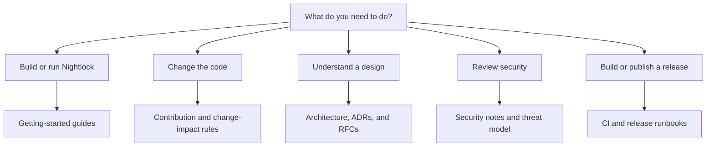

# Nightlock documentation

This directory is the entry point for Nightlock developer, security, and release documentation. Documentation is maintained as code and must change with the behavior it describes.

## Choose a journey

### New contributors

1. Read [prerequisites](getting-started/prerequisites.md).
2. Complete the [quickstart](getting-started/quickstart.md).
3. Use the [repository tour](getting-started/repository-tour.md).
4. Follow the [first-change tutorial](getting-started/first-change.md).
5. Read the root [contribution guide](../CONTRIBUTING.md).

### Current technical references

- [Vault file format](format.md) describes the authenticated envelope, TLV payload, compatibility behavior, and atomic save protocol.
- [Security notes](security.md) describe cryptography, secret memory, and accepted limitations.
- [Font resource notes](../apps/desktop/resources/fonts/README.md) explain the Apple font redistribution constraint.

### Governance

- [Documentation style](governance/documentation-style.md)
- [Change-impact rules](governance/change-impact.md)
- [Ownership model](governance/ownership.md)
- [ADR process](governance/adr-process.md)
- [RFC process](governance/rfc-process.md)
- [Documentation program](DOCUMENTATION_PLAN.md)

### Decision records

- [Architecture Decision Records](adr/README.md)
- [Request for Comments proposals](rfcs/README.md)

## Document maturity

| Status | Meaning |
|---|---|
| Draft | Useful working material that still needs technical review |
| Reviewed | Technically reviewed for the named baseline |
| Authoritative | Defines a maintained contract or required procedure |
| Historical | Preserved context that no longer defines current behavior |

Existing documents without an explicit status should be treated as reviewed descriptions of the current implementation, not as unchangeable standards.

## Where documentation belongs

| Topic | Location |
|---|---|
| First build and onboarding | `docs/getting-started/` |
| Local development and quality tools | `docs/development/` |
| Component boundaries and data flow | `docs/architecture/` |
| Threats, secrets, and cryptography | `docs/security/` |
| Exact commands, formats, and APIs | `docs/reference/` |
| CI, packages, releases, and incidents | `docs/operations/` |
| Writing, ownership, ADRs, and RFCs | `docs/governance/` |

Do not create a new page only to shorten an existing page. Split content when it has a distinct audience, owner, review cadence, or authoritative contract.

## Updating documentation

Every pull request must identify its documentation impact. Use the [change-impact decision tree](governance/change-impact.md) and update both prose and diagrams when a boundary or flow changes. English is the only language for durable repository documentation.
