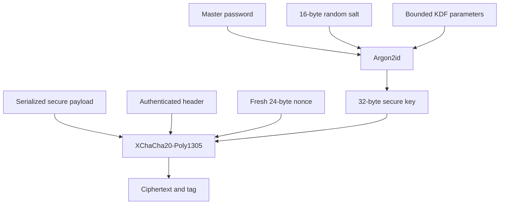

# ADR-0001: Vault cryptography

- **Status:** Accepted retrospectively
- **Recorded:** 2026-08-04
- **Implementation evidence:** `ce9d78e`
- **Owners:** Core and security owners

## Context

Nightlock needs password-derived authenticated encryption for a self-contained vault file. The reader must derive all required key material from a plaintext authenticated header while rejecting hostile parameters before expensive work.

## Decision

Use Argon2id v1.3 to derive a 32-byte key and XChaCha20-Poly1305 (IETF) to seal the payload. Store the salt, nonce, algorithm identifiers, and bounded KDF parameters in the header. Authenticate the entire header as associated data. Generate a new random nonce for every save and a new salt for password changes.

## Alternatives considered

Unknown. The decision predates the ADR process; no reliable record of historical alternatives was found.

## Consequences

- Wrong passwords and tampering intentionally share one authentication-failure result.
- KDF parameter clamps are part of the denial-of-service boundary.
- Algorithm identifiers permit future formats, but changing algorithms requires compatibility design and a new ADR/RFC.
- The current backend is libsodium, while the public crypto facade remains backend-neutral.

## Validation

See `tests/test_crypto.cpp`, `tests/test_vault_file.cpp`, `core/include/nightlock/crypto.hpp`, [security notes](../security.md), and [vault format](../format.md).
