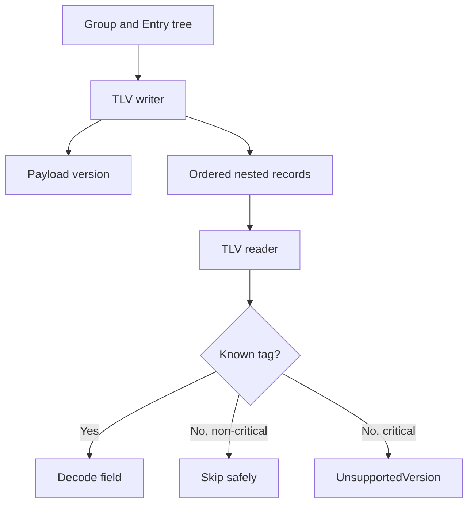

# ADR-0002: Versioned TLV payload compatibility

- **Status:** Accepted retrospectively
- **Recorded:** 2026-08-04
- **Implementation evidence:** `ce9d78e`
- **Owners:** Core owner

## Context

The encrypted domain model must preserve group and entry ordering while allowing optional fields to evolve without making every newer vault unreadable to older software.

## Decision

Encode the decrypted payload as nested type-length-value (TLV) records. A payload-version record defines semantic compatibility. Tags with bit `0x8000` are critical: unknown critical tags are rejected, while unknown non-critical tags are skipped. Stored child order is authoritative.

## Alternatives considered

Unknown. No evidenced pre-implementation design record exists.

## Consequences

- Optional fields can be added without an automatic payload-version bump.
- Semantics that old readers must not discard require a critical tag or newer payload version.
- Malformed lengths and truncated containers must fail closed.
- Writers must preserve custom ordering exactly.

## Validation

See `core/src/format/`, `tests/test_tlv.cpp`, `tests/test_serialize.cpp`, and [vault format](../format.md).
