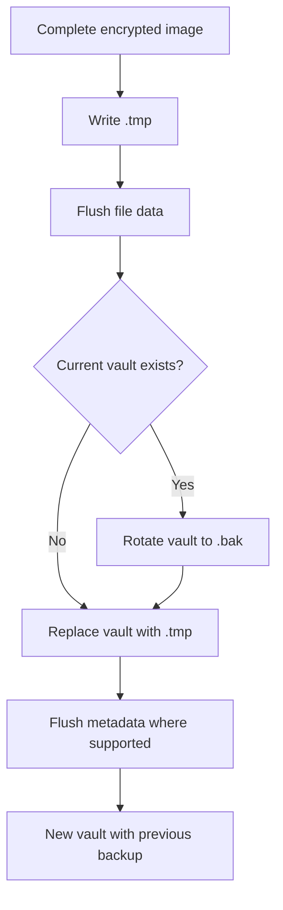

# ADR-0003: Atomic save and backup rotation

- **Status:** Accepted retrospectively
- **Recorded:** 2026-08-04
- **Implementation evidence:** `ce9d78e`, Windows port `785336e`
- **Owners:** Core and security owners

## Context

A crash or power loss during save must not leave the only vault image partially written. The protocol must work across POSIX systems and Windows while preserving a recoverable previous image.

## Decision

Write the complete new image to `<vault>.tmp`, flush it, rotate an existing vault to `<vault>.bak`, replace the vault with the temporary image, and request durable rename metadata where the platform permits it. Readers do not consume `.tmp` automatically.

## Alternatives considered

Unknown. Historical discussions were not recorded.

## Consequences

- A failed save can leave a `.tmp` or `.bak` requiring explicit diagnosis.
- Backup rotation is best effort on Windows before the final replace.
- Concurrent writers remain last-writer-wins; file locking is not part of this decision.
- Recovery procedures must never overwrite the only remaining good image without a copy.

## Validation

See `core/src/vault/atomic_write.cpp`, `tests/test_vault_file.cpp`, [vault format](../format.md), and [security notes](../security.md).
