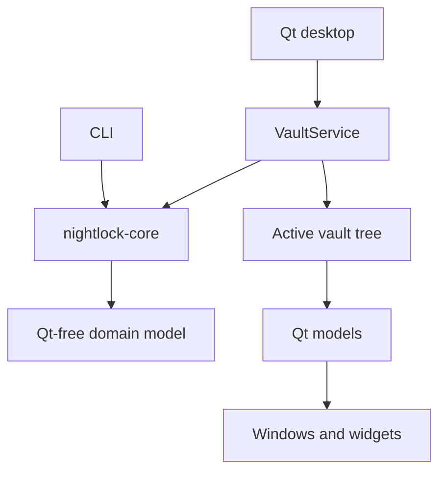

# ADR-0004: Qt desktop over a shared Qt-free core

- **Status:** Accepted retrospectively
- **Recorded:** 2026-08-04
- **Implementation evidence:** desktop skeleton `499b1ee`, persistence integration `ce9d78e`
- **Owners:** Desktop and core owners

## Context

Nightlock needs a native cross-platform desktop interface and a CLI that share identical vault behavior without coupling domain code to a UI toolkit.

## Decision

Use Qt Widgets and Qt SVG for the desktop adapter. Keep `nightlock-core` free of Qt types. Let both desktop and CLI link the same static core. The desktop's `VaultService` owns the active `VaultFile`; Qt models and windows adapt pointers into that session.

## Alternatives considered

Unknown. The original UI-toolkit decision predates this ADR process.

## Consequences

- Public core headers must not expose Qt.
- Raw UI pointers into the vault tree become invalid after lock or session replacement.
- The UI must clear dependent surfaces before wiping the vault.
- Qt widgets may copy displayed secrets into memory that the core cannot zeroize; this is an accepted limitation.

## Validation

See `apps/desktop/src/vaultservice.*`, `apps/desktop/src/windows/mainwindow.*`, `apps/desktop/src/models/`, and [security notes](../security.md).
