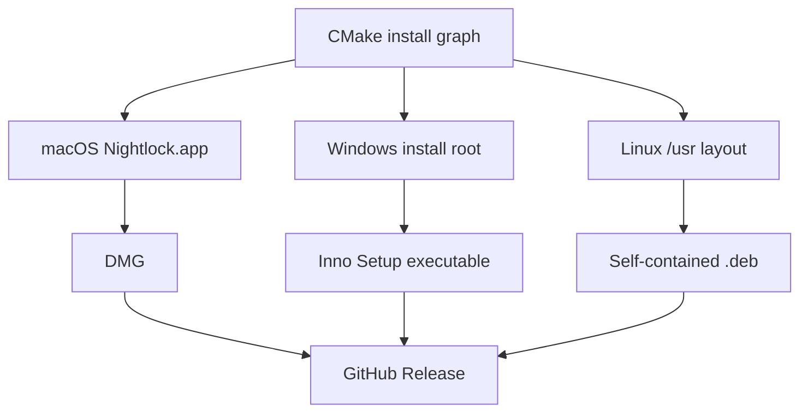

# ADR-0005: Platform-specific package layouts

- **Status:** Accepted retrospectively
- **Recorded:** 2026-08-04
- **Implementation evidence:** `a536f7d`
- **Owners:** Release and desktop owners

## Context

The GUI, CLI, Qt runtime, plugins, icons, and fonts require different conventional locations on macOS, Windows, and Linux. GUI and CLI names can also collide on case-insensitive filesystems.

## Decision

Use platform-specific CMake install layouts and package them as a macOS DMG, Windows Inno Setup executable, and Linux Debian package. Bundle the required Qt runtime dynamically. Resolve resources from installed locations with a source-tree development fallback.

## Alternatives considered

Unknown. The packaging implementation predates the ADR process.

## Consequences

- macOS places the CLI in `Contents/Helpers` to avoid a case-insensitive name collision.
- Windows places the GUI and Qt DLLs at the install root, plugins under `plugins`, the CLI in `bin`, and optionally adds that directory to machine PATH. Setup embeds and installs the official Visual C++ runtime before first launch.
- Linux places the GUI and private Qt runtime under `/usr/lib/nightlock` and the CLI under `/usr/bin`; package dependencies are derived from every shipped ELF object.
- macOS records a macOS 13 deployment target and ships universal Intel/Apple Silicon binaries.
- Package-specific installed-artifact smoke tests and license notices are required.
- Packages are currently unsigned; signing, notarization, SBOM, and provenance require a future prospective decision.

## Validation

See `apps/desktop/CMakeLists.txt`, `packaging/`, `.github/workflows/release.yml`, and [third-party notices](../../THIRD_PARTY_NOTICES.md).
