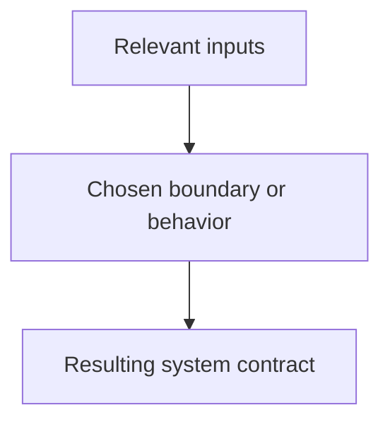

# ADR-NNNN: Decision title

- **Status:** Proposed
- **Date:** YYYY-MM-DD
- **Owners:** Role or team
- **Decision type:** Prospective or retrospective
- **Supersedes:** None
- **Superseded by:** None
- **Related RFCs:** None

## Context

Describe the forces, constraints, problem, and evidence without assuming the chosen solution.

## Decision

State the decision as a precise maintained contract.

## Alternatives considered

List evidenced alternatives. For a retrospective ADR, write `Unknown` when historical alternatives cannot be established.

## Consequences

### Positive

### Negative

### Risks and mitigations

## Security and privacy

## Compatibility and migration

## Operational impact

## Validation

Link tests, workflows, measurements, and implementation commits.
