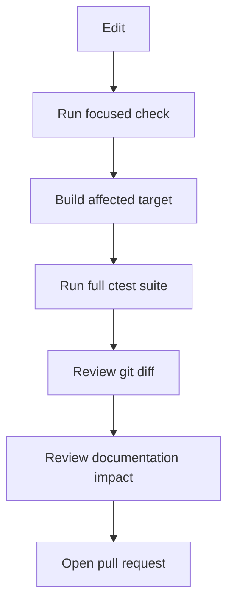

# Your first safe change

**Status:** Authoritative workflow  
**Audience:** First-time contributors

Choose a low-risk documentation, presentation, or isolated test improvement. Do not use a first contribution to change cryptography, vault bytes, atomic persistence, or secret lifetime.

## 1. Establish a clean baseline

```bash
git status --short --branch
cmake --build build --config Release --parallel
ctest --test-dir build --output-on-failure -C Release
```

Do not discard unrelated working-tree changes. If the baseline fails, determine whether the failure predates your work.

## 2. Create a focused branch

```bash
git switch main
git pull --ff-only
git switch -c NL-example-change
```

Use the repository's current branch naming convention when a task specifies one.

## 3. Identify impact before editing

Use the [change-impact guide](../governance/change-impact.md). Answer:

- Which component owns this behavior?
- Is it user-visible or a public contract?
- Can it affect vault compatibility or secret handling?
- Which focused test proves the outcome?
- Which document would become false after the change?

## 4. Implement the smallest complete change

Keep code, tests, and documentation together. Prefer an assertion that would fail before the fix and pass afterward. Use synthetic data and avoid personal filesystem paths in examples.

## 5. Validate in layers



At minimum:

```bash
cmake --build build --config Release --parallel
ctest --test-dir build --output-on-failure -C Release
git diff --check
git diff
```

## 6. Prepare the pull request

The description must state the problem, resulting behavior, implementation, tests, platform impact, security and compatibility impact, and documentation impact.

Do not claim platform validation that you did not perform. CI results complement local evidence; they do not replace a clear test plan.

## 7. Respond to review

Resolve review findings with a change, a test, evidence, or an explicit decision. If review reveals a durable architecture choice, pause implementation and record it through the ADR/RFC process.

## Completion checklist

- [ ] Working tree contained no accidentally modified user files.
- [ ] Change has one coherent purpose.
- [ ] Focused and full tests pass.
- [ ] No real secrets or personal paths are present.
- [ ] Documentation and diagrams remain correct.
- [ ] PR template is complete.
- [ ] Required CI checks pass before merge.
