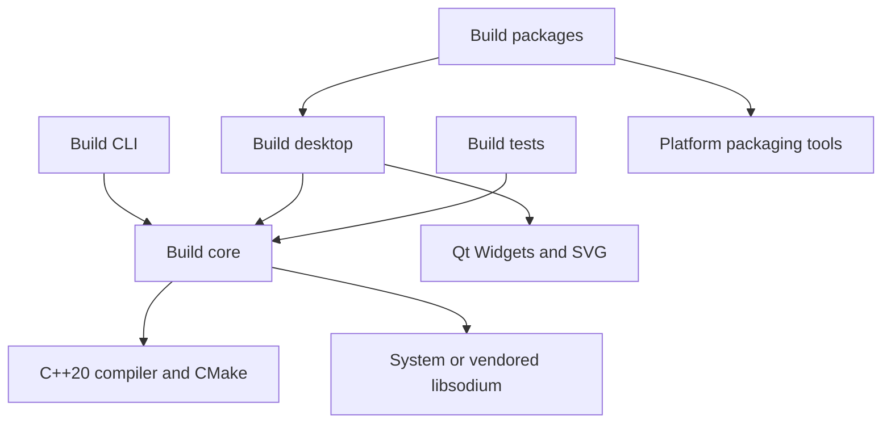

# Development prerequisites

**Status:** Reviewed for the 1.2.0 source baseline

**Audience:** Contributors preparing a first local build

## Common requirements

| Requirement | Minimum or expected version | Purpose |
|---|---:|---|
| CMake | 3.21 | Configure all targets and install layouts |
| C++ compiler | C++20-capable | Build core, CLI, and desktop |
| Qt | 6.10.1, Widgets and SVG | Build the desktop application |
| libsodium | 1.0.18 or vendored path | Cryptography and secure memory |
| Git | Modern supported release | Source and dependency checkout |
| Python | 3.9–3.13 when using `aqtinstall` | Install official Qt packages in CI-like setups |

The first forced-vendored configure requires network access to fetch the pinned `libsodium-cmake` source. Later builds reuse CMake's populated source tree.

The icon resources are large. Reserve several gigabytes for Qt, compiler outputs, vendored sources, and package staging.

## macOS

Install Xcode command-line tools, CMake, and Qt. A system libsodium is optional.

```bash
xcode-select --install
brew install cmake qt libsodium
```

Verify:

```bash
clang++ --version
cmake --version
"$(brew --prefix qt)/bin/qmake" -query QT_VERSION
pkg-config --modversion libsodium
```

Apple's San Francisco fonts are provided by macOS. Do not add downloaded font files to the repository.

## Windows

Install:

- Visual Studio 2022 with **Desktop development with C++**;
- a Windows 10/11 SDK;
- CMake;
- Qt 6.10.1 built for `msvc2022_64`.

Use a Developer PowerShell or a terminal where CMake and the Qt prefix are known. Verify:

```powershell
cmake --version
cl
Test-Path "$env:QT_ROOT_DIR\lib\cmake\Qt6\Qt6Config.cmake"
```

The vendored libsodium path is the supported CI baseline. Inno Setup is required only for installer production, not for normal development.

## Ubuntu 22.04

Install compiler and desktop runtime headers:

```bash
sudo apt-get update
sudo apt-get install -y \
  build-essential cmake ninja-build python3 python3-pip \
  libgl1-mesa-dev libxkbcommon-dev
```

Ubuntu 22.04's distribution Qt is older than the project baseline. Install official Qt 6.10.1 with the `linux_gcc_64` package through the Qt installer or `aqtinstall`.

```bash
python3 -m pip install --user aqtinstall
python3 -m aqt install-qt linux desktop 6.10.1 linux_gcc_64 --outputdir "$PWD/Qt"
```

Verify:

```bash
g++ --version
cmake --version
test -f "$PWD/Qt/6.10.1/gcc_64/lib/cmake/Qt6/Qt6Config.cmake"
```

`patchelf` is required only for `.deb` packaging.

## Build-scope dependencies



## Common prerequisite failures

| Symptom | Likely cause | First check |
|---|---|---|
| `Qt6Config.cmake` not found | Qt prefix is not discoverable | Set `CMAKE_PREFIX_PATH` to the Qt installation prefix |
| libsodium fetch cannot resolve GitHub | Network or proxy restriction | Use system libsodium or allow the first FetchContent download |
| MSVC generator selects the wrong architecture | Non-x64 shell or generator option | Use Visual Studio 2022 x64 and a matching Qt package |
| Linux compiles but GUI cannot start | Missing XCB/Wayland runtime dependency | Compare installed libraries with the Qt platform plugin error |
| Fonts differ across platforms | Licensed SF fonts are absent | Read the font resource README; do not commit the fonts |
