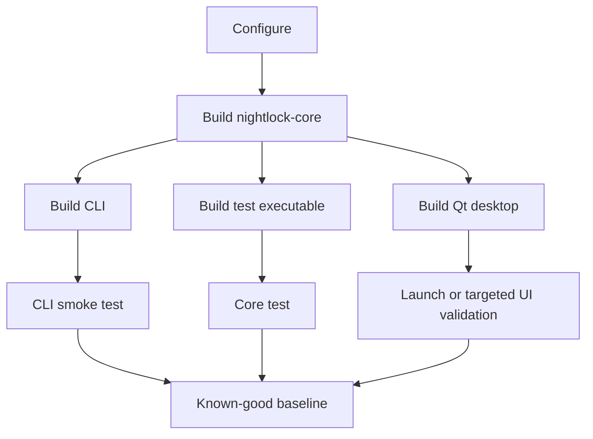

# Developer quickstart

**Status:** Reviewed for the 1.2.2 source baseline

**Audience:** Contributors who have completed the prerequisites

All examples assume the repository root as the current directory. Use a synthetic vault during development.

## Full build

### Single-config generators

```bash
cmake -S . -B build \
  -DCMAKE_BUILD_TYPE=Release \
  -DNIGHTLOCK_FORCE_VENDORED_SODIUM=ON
cmake --build build --parallel
ctest --test-dir build --output-on-failure
```

If Qt is not on the default search path, add `-DCMAKE_PREFIX_PATH=/absolute/path/to/Qt/6.10.1/platform_prefix` to configure.

### Visual Studio and other multi-config generators

```powershell
cmake -S . -B build `
  -DCMAKE_PREFIX_PATH="$env:QT_ROOT_DIR" `
  -DNIGHTLOCK_FORCE_VENDORED_SODIUM=ON
cmake --build build --config Release --parallel
ctest --test-dir build --output-on-failure -C Release
```

## Reduced build scopes

CLI and core without Qt desktop:

```bash
cmake -S . -B build-cli \
  -DNIGHTLOCK_BUILD_DESKTOP=OFF \
  -DNIGHTLOCK_FORCE_VENDORED_SODIUM=ON
cmake --build build-cli --parallel
ctest --test-dir build-cli --output-on-failure
```

Core and tests without either application:

```bash
cmake -S . -B build-core \
  -DNIGHTLOCK_BUILD_DESKTOP=OFF \
  -DNIGHTLOCK_BUILD_CLI=OFF \
  -DNIGHTLOCK_FORCE_VENDORED_SODIUM=ON
cmake --build build-core --parallel
ctest --test-dir build-core --output-on-failure
```

## Run the applications

On macOS, launch the desktop bundle through Launch Services. The target
registers the freshly signed bundle before opening it, so system-owned UI
such as Touch ID reads the current application metadata and icon:

```bash
cmake --build build --target run-nightlock
```

Do not launch `Nightlock.app/Contents/MacOS/Nightlock` directly during UI
development; doing so bypasses bundle registration and can leave system
dialogs attached to stale metadata.

```bash
build/apps/cli/nightlock --version
build/apps/cli/nightlock --help
```

With a Visual Studio Release build:

```powershell
build\apps\cli\Release\nightlock.exe --version
```

Desktop output is `Nightlock.app` on macOS, `Nightlock.exe` on Windows, and `nightlock-desktop` on Linux. Generator-specific subdirectories may add `Release`.

## Exercise a synthetic CLI vault

The following password is disposable test data, not an example for real use:

```bash
printf 'test-only-password\n' | \
  build/apps/cli/nightlock -f build/example.nlck --password-stdin init

printf 'test-only-password\n' | \
  build/apps/cli/nightlock -f build/example.nlck --password-stdin mkdir Personal

printf 'test-only-password\n' | \
  build/apps/cli/nightlock -f build/example.nlck --password-stdin ls
```

## Expected test baseline

```text
core       - doctest unit and integration coverage
cli_smoke  - end-to-end CLI create/mutate/read/error behavior
```

Both must pass. The desktop currently relies on compilation plus targeted manual/debug-hook validation; this is a known test-strategy gap.



## Success criteria

- configure completes without unresolved dependencies;
- all requested targets compile;
- `ctest` reports zero failed tests;
- `nightlock --version` matches the CMake project version;
- a synthetic CLI vault can be created and reopened;
- the desktop starts without a missing Qt plugin or resource error.
