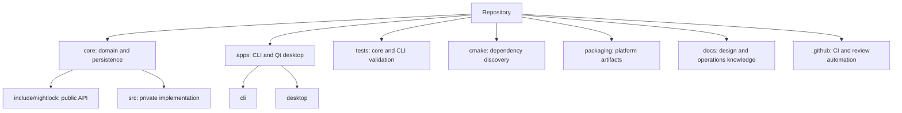
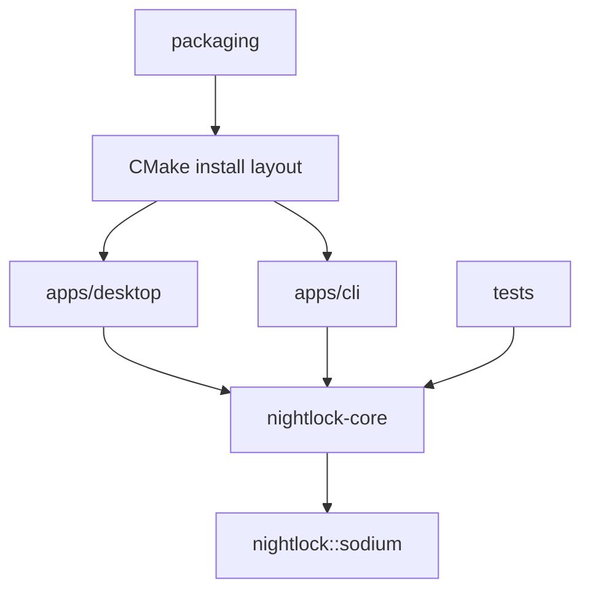

# Repository tour

**Status:** Reviewed for the 0.2.0 source baseline  
**Audience:** Developers locating the correct change boundary

## Top-level map

| Path | Responsibility | Read before editing |
|---|---|---|
| `core/include/nightlock/` | Public Qt-free C++ API | Header contracts and security notes for secret-bearing types |
| `core/src/crypto/` | libsodium-backed crypto facade | Security notes, format specification, and ADR requirement |
| `core/src/format/` | TLV and model serialization | Format specification and compatibility tests |
| `core/src/model/` | Group/entry ownership and ordering | `test_group.cpp` and serialization rules |
| `core/src/secure/` | Locked and zeroized containers | Security limitations and platform behavior |
| `core/src/vault/` | Session, save, recovery, and errors | Format, atomic-save protocol, and vault tests |
| `core/src/generator/` | CSPRNG-backed password generation | Generator tests and crypto facade |
| `apps/cli/` | Arguments, terminal I/O, command adapter | CLI smoke test and cross-platform branches |
| `apps/desktop/src/models/` | Qt model adapters over core pointers | Pointer invalidation on lock/open |
| `apps/desktop/src/windows/` | Main desktop windows and flows | Vault service lifecycle and debug-hook classification |
| `apps/desktop/src/widgets/` | Reusable Qt presentation widgets | Accessibility and secret-copy implications |
| `apps/desktop/resources/` | Qt resources, icons, optional fonts | Licensing and installed resource paths |
| `tests/` | doctest core coverage and CLI smoke script | Testing conventions and platform behavior |
| `packaging/` | DMG, Inno Setup, and Debian construction | CMake install layout and release runbook |
| `.github/workflows/` | Build and release automation | Permissions, triggers, and artifact contracts |
| `docs/` | Versioned developer knowledge | Documentation style and change-impact rules |

## Dependency direction

Qt types must not enter `core/include/nightlock/`. Private serializer and TLV headers remain implementation details even though tests include them directly.

## Generated and external content

- `build/` is generated and ignored.
- `third_party/doctest/` is vendored upstream code; do not reformat it with project-wide tools.
- Qt and vendored libsodium build trees are external content.
- San Francisco font files must remain untracked.
- Package output must not be committed unless an artifact policy explicitly requires it.

## Ownership hazards

The desktop holds raw `Group*` and `Entry*` pointers into the active `VaultFile` tree. Locking or replacing a vault destroys that tree. UI surfaces and models must clear their pointers before `VaultFile::lock()` or session replacement.

The CLI opens a vault per command. Mutating commands must save explicitly; read-only commands must not rewrite the file.
