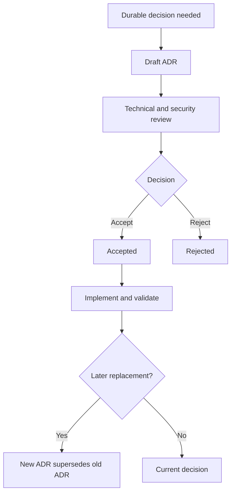

# Architecture Decision Record process

**Status:** Authoritative

An Architecture Decision Record (ADR) captures a durable technical decision and its consequences. It does not replace implementation documentation or a large pre-decision RFC.

## When an ADR is required

- changing cryptography, format compatibility, persistence, or recovery;
- changing durable module boundaries or ownership;
- adopting a major dependency or platform strategy;
- changing package layout, signing, or release trust;
- accepting a material security or operational limitation.

## Lifecycle

## Rules

- Number ADRs sequentially with four digits.
- Use the template in `docs/adr/template.md`.
- Accepted ADRs are immutable except for status links and typographical corrections.
- A changed decision creates a new ADR and marks the old one superseded.
- Link implementation commits and validating tests.
- Do not invent rejected alternatives, meetings, or rationale.
- Existing decisions documented after implementation use `Accepted retrospectively` and cite evidence.

## Review and merge

The mapped subsystem owner reviews technical accuracy. Security-sensitive ADRs require security review; release-impacting ADRs require release review. Implementation should not merge ahead of a required decision unless an incident demands a documented temporary exception.
