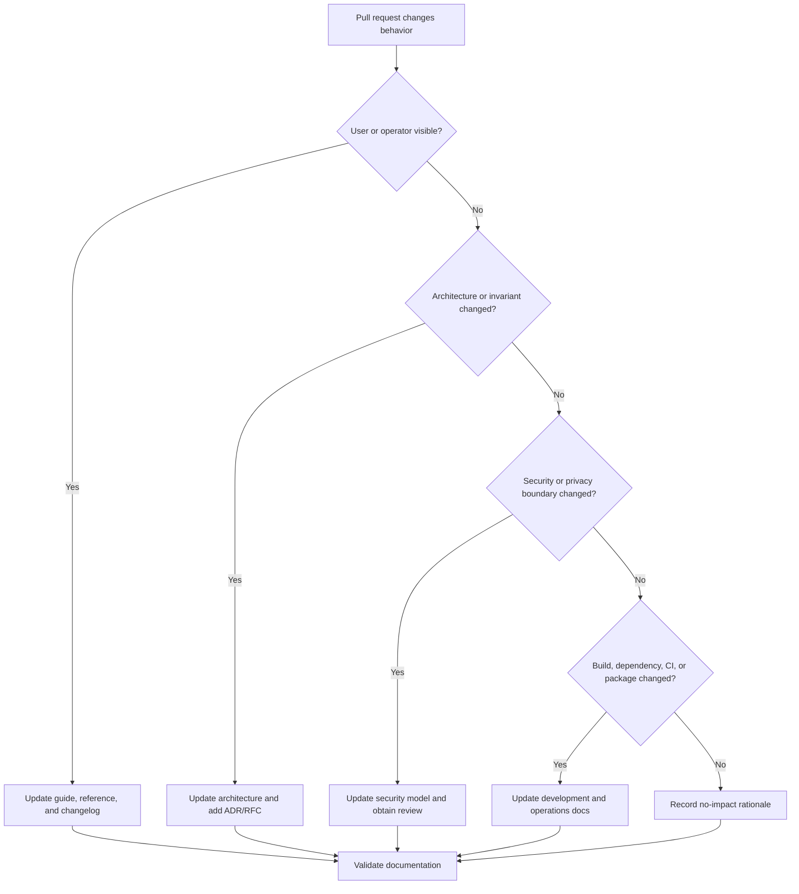

# Documentation change impact

**Status:** Authoritative  
**Audience:** Authors and reviewers of every pull request

Documentation is part of the behavior change, not a follow-up task.

## Path mapping

| Changed path | Review at minimum |
|---|---|
| `core/include/nightlock/` | Core API and ownership contracts |
| `core/src/crypto/` | Cryptography, threat model, vectors, ADR |
| `core/src/format/` | Vault format, compatibility, migration |
| `core/src/secure/` | Secret lifecycle and limitations |
| `core/src/vault/` | Persistence, recovery, errors, security |
| `apps/cli/` | CLI syntax, streams, exits, environment, examples |
| `apps/desktop/` | Desktop architecture, state flows, resources, accessibility |
| `tests/` | Testing strategy and coverage map |
| `CMakeLists.txt`, `cmake/` | Prerequisites, configuration, dependencies |
| `.github/workflows/` | CI/release runbooks, permissions, artifacts |
| `packaging/` | Package layout, notices, release validation |

## No-impact statements

`No documentation impact` is acceptable only with a reason, for example:

- internal refactor preserves documented ownership and behavior;
- test-only change does not alter the test procedure or quality policy;
- comment or naming correction leaves all public terminology unchanged.

An unexplained checkbox is not evidence.

## Reviewer questions

- Would following current documentation produce the new behavior?
- Did a diagram, command, version, path, error, artifact, or guarantee become false?
- Does the changelog need a user-visible entry?
- Does the change introduce an undocumented trust boundary or dependency?
- Does it require an ADR, RFC, migration, rollback, or disclosure update?
