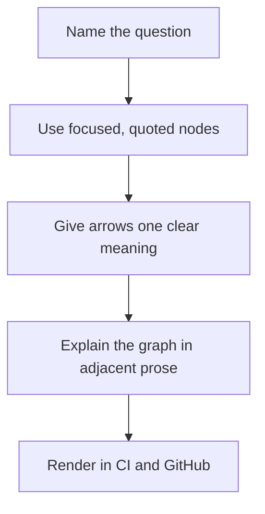

# Documentation style

**Status:** Authoritative  
**Owner:** Documentation owner

## Language and voice

- Write durable repository documentation in English only.
- Use American English unless quoting a platform term.
- Use active voice and present tense for current behavior.
- Put the outcome before implementation details.
- Use `must` for requirements, `should` for strong recommendations, and `may` for options.
- Avoid language such as "simply," "obviously," and "just."
- Label proposed, historical, unsupported, and future behavior explicitly.

## Standard page contract

A durable page should identify:

1. title and purpose;
2. status and primary audience;
3. scope and prerequisites;
4. authoritative code, tests, workflows, or decisions;
5. current behavior or procedure;
6. failure modes and unsafe recovery actions;
7. validation or success criteria;
8. related documents and owner.

Small indexes and root policy files may omit metadata when ownership and status are obvious.

## Structure

- Use one level-one heading per file.
- Use sentence case for headings.
- Organize tutorials by task order and references by stable taxonomy.
- Keep paragraphs focused on one claim.
- Use tables for exact mappings, not long narrative.
- Split a page only when audience, owner, review cadence, or contract differs.
- Preserve direct GitHub readability even when a documentation site is added.

## Commands and examples

- Use fenced blocks with a language identifier.
- Do not include shell prompts in copyable commands.
- State the working directory and prerequisites.
- Use synthetic secrets and generic absolute-path placeholders.
- Pair non-trivial commands with an expected outcome.
- Label destructive, irreversible, secret-exposing, or compatibility-breaking actions before the command.
- Prefer examples that CI can execute or compare against generated output.

## Security language

Distinguish:

- **Guarantee:** enforced for supported configurations.
- **Best effort:** attempted but can fail because of platform or resource constraints.
- **Accepted limitation:** understood residual exposure.
- **Unsupported:** outside the maintained contract.
- **Future work:** desired but not committed behavior.

Security claims must link to code, tests, a frozen vector, CI evidence, or an accepted ADR.

## Mermaid diagrams

Use Mermaid `graph TD` regularly for architecture, dependencies, state, data flow, secret flow, decisions, CI, release, and navigation.

Rules:

- begin standard diagrams with `graph TD`;
- quote labels containing spaces or punctuation;
- target 5–15 nodes and split larger models;
- label decision edges;
- do not encode critical meaning only with color;
- keep names consistent with prose and code;
- update the diagram in the same PR as the modeled behavior.

## Links and terminology

- Use relative links for repository content.
- Link to authoritative upstream sources rather than blogs for dependencies and standards.
- Avoid unstable line-number links in durable documents.
- Define acronyms on first use.
- Use these preferred terms: **vault**, **entry**, **group**, **desktop application**, **CLI**, **core**, **artifact**, and **release**.

## Review

Technical pages require subsystem-owner review. Security and release pages require the corresponding specialist role. A documentation-only change still needs validation for links, examples, diagrams, and consistency with current code.
