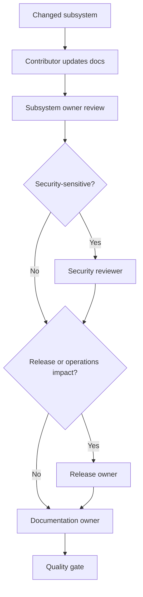

# Documentation ownership

**Status:** Authoritative role model

Ownership names responsibilities even when one maintainer currently fills several roles.

| Role | Scope |
|---|---|
| Documentation owner | Information architecture, style, validation, backlog, freshness |
| Core owner | Domain model, public API, serialization, persistence |
| Desktop owner | Qt architecture, state, resources, accessibility |
| CLI owner | Commands, streams, exits, terminal and path behavior |
| Security reviewer | Threat model, secret lifecycle, crypto, privacy, supply chain |
| Release owner | Workflows, packages, signing, provenance, validation, rollback |

## Freshness

- Authoritative architecture and security pages receive review at least annually and after triggering changes.
- Release runbooks receive review during every release.
- Broken commands or security claims are corrected before the affected change or release proceeds.
- Ownership should move from individual usernames to teams when the maintainer group grows.

GitHub routing is implemented in [`.github/CODEOWNERS`](../../.github/CODEOWNERS).
