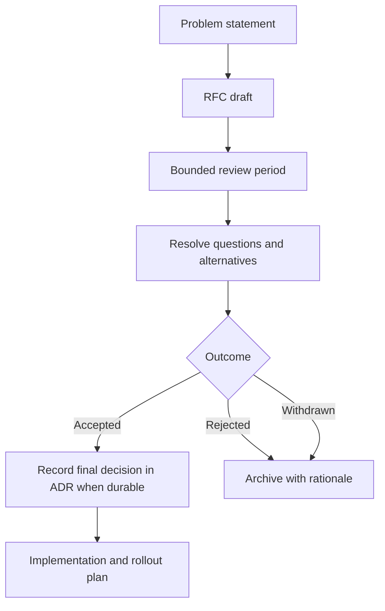

# Request for Comments process

**Status:** Authoritative

Use a Request for Comments (RFC) to obtain structured review before implementing a large or uncertain change.

## RFC triggers

- multiple viable designs with significant trade-offs;
- cross-platform or staged rollout;
- vault migration or backward-compatibility risk;
- new telemetry, network behavior, update delivery, or secret storage;
- substantial dependency, build, or release-system change;
- work that spans several pull requests or owners.

## Lifecycle

## Required content

An RFC includes motivation, goals, non-goals, detailed design, alternatives, security and privacy, compatibility, migration, tests, documentation, rollout, rollback, operations, and unresolved questions.

## Scope control

- Give review a stated start and end.
- Separate blocking questions from preferences.
- Record the final outcome and rationale.
- Do not use an RFC to hide an already irreversible implementation.
- Keep implementation PRs linked to the accepted proposal and resulting ADRs.

Use `docs/rfcs/template.md` and index every proposal in `docs/rfcs/README.md`.
