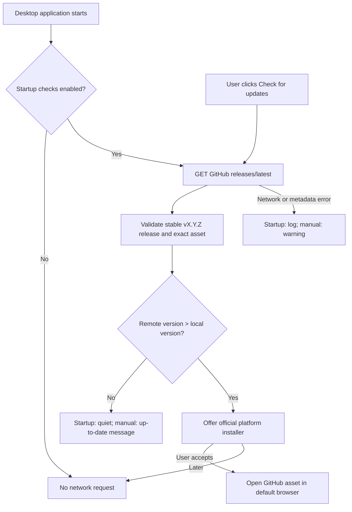

# RFC-0001: Stable GitHub release update checks

- **Status:** Draft
- **Authors:** Nightlock contributors
- **Review period:** 2026-08-29 to 2026-09-05
- **Related ADRs/issues:** [Issue #26](https://github.com/res138/nightlock/issues/26)

## Summary

Add an opt-out update check to the desktop application. Nightlock checks the
latest published, non-prerelease GitHub Release after startup, compares its
strict semantic version with the running build, and offers the matching
platform installer when a newer version exists. Settings also provide a manual
check that reports success and failure explicitly.

This proposal does not silently download, execute, or install release
artifacts. Current packages are unsigned, and each supported operating system
has a different installation and privilege model.

## Motivation

Nightlock publishes verified installers for macOS, Windows, and Ubuntu, but an
installed copy currently has no way to discover a newer release. The existing
General settings page contains an unconnected **Check for updates** button and
an in-memory-only toggle whose text promises behavior that does not exist.

## Goals

- Make the existing manual update action functional.
- Check once, asynchronously, on application startup by default.
- Persist an opt-out setting and leave manual checks available when opted out.
- Consider only the repository's latest stable GitHub Release.
- Select installers using the release workflow's exact platform filenames.
- Keep startup quiet when the build is current or GitHub is unavailable.
- Preserve deterministic demo and screenshot runs without outbound traffic.

## Non-goals

- Silent download, self-replacement, package-manager elevation, or execution.
- Supporting prereleases, historical alpha tags, or a second release channel.
- Replacing GitHub Releases with a Nightlock-operated update service.
- Adding telemetry, installation identifiers, crash reports, or vault data to
  update requests.
- Establishing publisher authenticity before release signing exists.

## Detailed design

The desktop application sends an unauthenticated HTTPS `GET` request to:

`https://api.github.com/repos/res138/nightlock/releases/latest`

The request identifies itself as `Nightlock/<running version>` and asks for the
GitHub JSON media type. Concurrent startup and manual checks are coalesced into
one in-flight request. A manual action that joins a startup request promotes its
result to manual feedback.

The response is accepted only when all of these conditions hold:

- the JSON root is an object;
- `draft` and `prerelease` are false;
- `tag_name` is exactly `vMAJOR.MINOR.PATCH`;
- `html_url` is the exact HTTPS GitHub page for that tag in
  `res138/nightlock`;
- a supported platform has exactly one uploaded asset with the filename
  derived from the parsed version;
- its `browser_download_url` is the exact HTTPS GitHub download path.

The current release workflow defines these asset names:

| Platform | Asset |
|---|---|
| macOS 13+, Intel and Apple Silicon | `Nightlock-VERSION-macOS.dmg` |
| Windows 10/11 x64-compatible | `Nightlock-VERSION-Windows-Setup.exe` |
| Ubuntu 22.04 amd64 | `nightlock_VERSION_amd64.deb` |

Version comparison is numeric through `QVersionNumber`. Equal and older remote
versions are not updates, which also prevents a development build from being
downgraded. Unsupported architectures may view the release page but are not
offered an incompatible installer.

`QSettings` stores the preference at `updates/check-on-startup`; absence means
enabled. Changing it affects subsequent launches. Demo mode always suppresses
the startup request, while its manual Settings action remains available.

## Alternatives

- **Open `releases/latest` without using the API.** This cannot distinguish an
  up-to-date build or select a platform asset reliably.
- **List releases and choose the greatest version.** This adds pagination and
  selection complexity. The release workflow publishes its intended current
  full release as latest; strict parsing and a local version comparison still
  defend against historical tag anomalies and downgrades.
- **Download and execute automatically.** Rejected for this iteration because
  the artifacts are unsigned, GitHub releases are not immutable, macOS uses a
  drag-install DMG, Windows uses Inno Setup, and Debian installation requires a
  package manager and elevation.
- **Third-party updater framework.** Rejected for this bounded check because it
  adds a larger dependency and trust surface without solving code signing or
  cross-platform installer policy.

## Security and privacy

The startup default creates a new outbound privacy boundary. GitHub and the
network path can observe the user's IP address, request time, TLS metadata, and
the `Nightlock/<version>` User-Agent. Nightlock sends no vault contents, paths,
passwords, entry data, persistent identifier, or application settings.

HTTPS certificate validation remains enabled; redirects may not downgrade to
an insecure scheme. Release and asset URLs are constrained to exact paths in
the official repository. Remote release notes are displayed as plain text.
Network and parser failures never include vault data and remain non-blocking.

The GitHub API and checksums from the same workflow provide transport and
integrity checks, not independent proof of publisher identity. Until Windows
Authenticode, Apple Developer ID/notarization, Debian signing, and immutable
release policy are in place, the application must not launch an installer or
claim a silent trusted update.

## Compatibility and migration

No vault format, CLI, or core API changes occur. Existing settings stores gain
one boolean key with a default of true. Removing the feature leaves that key
harmless. Qt Network and the platform-native TLS backend become desktop runtime
dependencies and must be included in all release packages.

## Testing and quality plan

- Unit-test the default and persisted preference.
- Unit-test strict version parsing and numeric comparison.
- Unit-test rejection of drafts, prereleases, malformed tags, foreign URLs,
  duplicate assets, and missing assets.
- Unit-test exact platform asset selection from synthetic GitHub JSON.
- Build and run the complete desktop/core/CLI test suite.
- Verify packaged Qt Network and TLS runtime closure for macOS, Windows, and
  Linux in the existing release-package smoke tests.
- Exercise the manual current, newer, malformed, offline, and timeout paths.

## Documentation plan

Update the changelog, README feature and dependency summaries, support policy,
security network-boundary notes, RFC index, and package verification contracts
in the same change.

## Rollout and observability

Ship the check in one release on all supported platforms. Observe public issue
reports for TLS backend failures, GitHub rate limiting, proxy incompatibility,
incorrect asset selection, and startup prompts. Automatic failures are written
only to the local diagnostic stream; Nightlock does not upload logs.

## Rollback

Users can disable startup checks immediately in General settings. A maintenance
release can remove the startup call while retaining the manual action, or
remove the Qt Network source and package dependencies entirely. No vault or
settings migration is required.

## Operational ownership

Desktop maintainers own request behavior and UI. Release maintainers own the
asset naming and publication contract. Security reviewers own future changes
that download, verify, sign, or execute installers.

## Unresolved questions

- Should a future signed-update design download in-app or delegate entirely to
  native package managers?
- Should future checks use conditional requests and a persisted ETag if the
  startup frequency or GitHub rate limits become operationally significant?
- When will release immutability and platform code signing be mandatory?

## Decision

Pending review.
