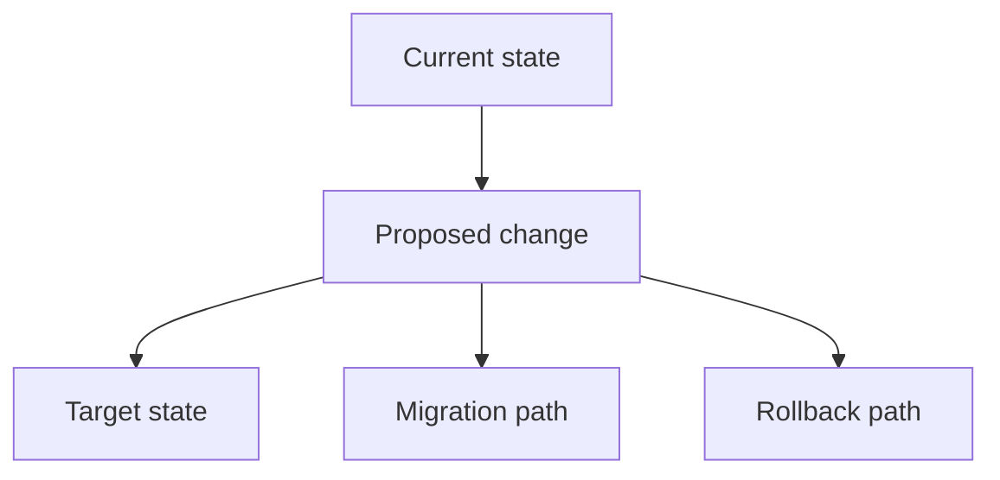

# RFC-NNNN: Proposal title

- **Status:** Draft
- **Authors:** Names or roles
- **Review period:** YYYY-MM-DD to YYYY-MM-DD
- **Related ADRs/issues:** None

## Summary

## Motivation

## Goals

## Non-goals

## Detailed design

## Alternatives

## Security and privacy

## Compatibility and migration

## Testing and quality plan

## Documentation plan

## Rollout and observability

## Rollback

## Operational ownership

## Unresolved questions

## Decision

Complete after review with outcome, rationale, and follow-up links.
